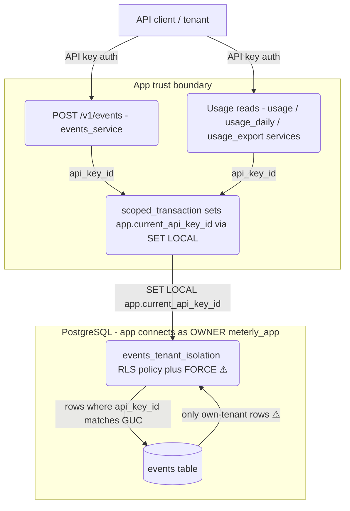

# Plan — FORCE ROW LEVEL SECURITY on `events`

## Summary

The `events` table (created in migration `0001`) has `ENABLE ROW LEVEL SECURITY`
plus a tenant-isolation policy (`events_tenant_isolation`), but it was never
`FORCE`d. Because the runtime app and the Alembic migration job both connect as
`meterly_app` — which **owns** the table — and a PostgreSQL table owner
**bypasses** non-`FORCE` RLS regardless of `NOBYPASSRLS`, the policy is **inert
for the app role**: a named defense-in-depth backstop with zero efficacy. This is
the identical defect fixed for `usage_rollup` in migration `0004` and for `quotas`
in `0003`. The fix is a one-statement Alembic migration `0005` that runs
`ALTER TABLE events FORCE ROW LEVEL SECURITY` (with a symmetric `NO FORCE`
downgrade), plus a DB-layer owner-role efficacy test that proves tenant isolation
by connecting as a non-superuser table owner and asserting it sees only its own
tenant's rows — a test that **fails against the pre-`FORCE` schema and passes
after**. The change is behavior-preserving for every endpoint because every
runtime reader/writer of `events` already executes inside `scoped_transaction`,
which issues `SET LOCAL app.current_api_key_id`, so under `FORCE` each query still
returns exactly the rows the application `api_key_id` predicate already returns.

**What/why/how of the core approach.** *What:* mirror `0004`'s shape exactly —
a pure grant-semantics toggle, no DDL on rows or columns, symmetric down. *Why
over alternatives:* the two realistic alternatives are (a) re-`CREATE POLICY` with
tighter predicates, or (b) switch the app to a non-owner `NOBYPASSRLS` role so the
existing `ENABLE` (non-`FORCE`) policy binds. (a) is unnecessary — the policy
predicate from `0001` is already correct and identical to the proven
`usage_rollup`/`quotas` ones; re-creating it would add risk and diverge from the
sanctioned remediation pattern. (b) is a much larger, riskier change (new role
provisioning in `infra/`, ownership reassignment of every table, migration-job
credential changes) that the finding does not require and the sibling tables
(`quotas`, `usage_rollup`) did not take — consistency with the already-shipped
`FORCE` remediation is the lower-risk, reviewable path. *How it works in this
system:* `FORCE ROW LEVEL SECURITY` tells PostgreSQL to apply row-security policies
to the table **owner** too (owners are exempt under plain `ENABLE`). The existing
`events_tenant_isolation` policy predicate — `api_key_id = current_setting(
'app.current_api_key_id', true)::bigint` — then binds every SELECT/INSERT/UPDATE/
DELETE the `meterly_app` owner issues to the tenant id set by `scoped_transaction`.

## Data / migrations (primary layer)

**Add `alembic/versions/0005_force_rls_events.py`** — mirrors
`0004_force_rls_usage_rollup.py` in structure, docstring rigor, and reversibility
contract:

- `revision = "0005"`, `down_revision = "0004"` (chains onto the current head
  `0004`; `test_no_new_alembic_migration_added` confirms `0004` is head today).
- `upgrade()`: `op.execute("ALTER TABLE events FORCE ROW LEVEL SECURITY")`.
- `downgrade()`: `op.execute("ALTER TABLE events NO FORCE ROW LEVEL SECURITY")`.
- No policy creation — `events_tenant_isolation` already exists from `0001`; this
  migration only flips the owner-binding on the existing policy.

**Why this is behavior-preserving (the enabling condition that makes the mitigation
both effective and safe — U-02).** The policy binds `api_key_id` to the session GUC
`app.current_api_key_id`. Every legitimate runtime path already sets that GUC:
- writes: `src/services/events_service.py:86` wraps the ingest write in
  `scoped_transaction(principal.api_key_id)`;
- reads: `src/services/usage_service.py`, `usage_daily_service.py`, and
  `usage_export_service.py` all read `events`/`usage_rollup` inside
  `scoped_transaction`, which issues `SELECT set_config('app.current_api_key_id',
  :id, true)` via `SET LOCAL` before the first query
  (`src/db/session.py:58`–`85`).
Under `FORCE`, each of these still sees exactly the rows the explicit
`api_key_id = :api_key_id` application predicate already selects — no legitimate
query result changes. Because `0001`'s policy declares `USING (...)` with no
explicit `WITH CHECK`, PostgreSQL reuses the `USING` expression as the `WITH CHECK`
for INSERT/UPDATE, so cross-tenant **writes** are constrained under `FORCE` on the
same predicate — consistent with the `usage_rollup`/`quotas` design.

**Reversibility (grant-semantics-toggle kind — audit E6).** This is neither a
create-migration nor an expand/contract on a populated table: no rows, columns, or
constraints are touched. `up → down → up` restores the policy's **binding state**
identically (owner bound under `FORCE`; owner bypasses under `NO FORCE`), and it is
a no-op on data. The correct reversibility assertion here is therefore
"binding-state restored / no error across the round-trip," **not** row survival
(there are no rows to survive). This is already exercised transitively: the
existing chain round-trip tests (`tests/integration/test_migrations.py`) run
`downgrade base` / `upgrade head`, which pass through `0005`'s `down` and `up`;
Alembic fails loudly if either errors.

## Backend

**No change.** No route, service, repository, or schema is added or modified. The
`events` ingest and usage-read endpoints keep their exact current behavior (proven
by the full existing suite staying green). This section is stated explicitly so the
plan does not silently omit a layer: the feature is a data-layer security control
only.

## Auth (data-layer tenant isolation — not endpoint auth)

No endpoint authentication/authorization changes. The control this feature
hardens is **data-layer** tenant isolation: PostgreSQL RLS acting as the
defense-in-depth backstop behind the application's explicit `api_key_id` scoping.
The API-key authentication facade, scopes, and per-key rate limiting are untouched.
The only privilege-model fact that matters here — and the reason `FORCE` is
required — is that `meterly_app` is the table **owner** (it holds `CREATE ON
SCHEMA public` and created the table via migrations), and owners bypass non-`FORCE`
RLS. The least-privilege `NOBYPASSRLS` `meterly_app` role is already provisioned in
`infra/modules/data/main.tf`; no infra change is needed.

## Infrastructure

**No `infra/` change.** No cloud resources are provisioned or modified; the DB
role, RDS instance, and network config are unchanged. (Consequently the STRIDE
cloud-attack-surface trigger does not fire — there is no new IAM, bucket, or
security-group surface.) Note for the operator: `0005` runs in the normal
`alembic upgrade head` deploy step (CLAUDE.md → "Migrate"), like every prior
migration; it is a fast metadata-only `ALTER` with no table rewrite or lock
escalation beyond a brief `ACCESS EXCLUSIVE` on `events`.

## Logging / observability

**No new observable events.** The migration emits no application logs; RLS
enforcement is silent at the DB layer (a confined query simply returns fewer/zero
rows, it does not raise). No log fields, levels, or redaction rules change. Stated
explicitly so the layer is not silently omitted.

## Testing (DB-layer owner-role efficacy test)

**Add `tests/integration/test_events_rls_backstop.py`** — a faithful mirror of
`tests/integration/test_usage_rollup_rls_backstop.py`, retargeted to `events`:

- Reuse the shared integration fixtures `postgres_url` and `make_api_key`
  (`tests/integration/conftest.py`).
- An `events_owner_role` fixture: create a `NOBYPASSRLS`, non-superuser login role
  with `USAGE, CREATE ON SCHEMA public`, `ALTER TABLE events OWNER TO <role>`,
  yield its real DSN (`render_as_string(hide_password=False)`), and restore the
  original owner + drop the role in teardown — exactly as the `usage_rollup`
  fixture does, so the shared session container is left as found.
- A `_seed_events` helper that inserts one `events` row per tenant **as the
  testcontainers superuser** (superuser bypasses RLS, so setup is unconstrained).
  It must supply every NOT NULL column without a server default:
  `api_key_id, customer_id, metric, quantity, idempotency_key, window_start`
  (`event_time`/`created_at`/`id` have defaults) and satisfy the
  `ck_events_quantity_positive` CHECK (`quantity > 0`) and the
  `uq_events_api_key_idempotency_key` UNIQUE.
- `test_rls_confines_table_owner_read_when_app_filter_is_absent`: seed two tenants,
  connect as the owner role, `set_config('app.current_api_key_id', tenant_a)`,
  issue `SELECT api_key_id FROM events` with **no** `api_key_id` predicate (primary
  control simulated absent), assert `seen_ids == {tenant_a}`.
- `test_rls_denies_all_rows_to_owner_when_tenant_setting_is_unset`: fail-closed —
  connect as the owner without ever setting the GUC, assert zero rows.

**Why this test, connecting as a non-superuser owner (what/why/how).** *What:* the
witness role is a non-superuser table **owner**, not the `NOBYPASSRLS` non-owner
used by `test_quotas_rls_backstop.py`. *Why:* the finding under guard is *owner
bypass*. A non-owner `NOBYPASSRLS` role is already bound by RLS under plain
`ENABLE`, so it would pass both before and after `0005` and could not witness the
fix; the testcontainers superuser bypasses RLS entirely regardless of `FORCE`, so a
query over `postgres_url` would never exercise the policy. A non-superuser *owner*
is the only role class whose visibility flips on `FORCE` — the genuine
fails-before-`0005` / passes-after-`0005` witness. *How:* under non-`FORCE` the
owner bypasses the policy and sees both tenants → assertion fails; under `FORCE`
the policy binds the owner → sees only its own tenant → passes.

**Update `tests/integration/test_quotas_list_delete.py`** (required so existing
tests stay green): `test_no_new_alembic_migration_added` (AC14) hard-asserts the
exact revision-file set `{0001, 0002, 0003, 0004}`. Add
`"0005_force_rls_events.py"` to that expected list, with a one-line comment noting
`0005` is the sanctioned `events` RLS remediation for **this** feature (a separate
feature from quota-list/delete), so AC14's real intent — the quota list/delete
feature smuggled in no migration of its own — still holds. The existing DDL-target
guard on `0004` (`ALTER TABLE` targets == `{usage_rollup}`) is left unchanged.

**Test strategy: `integration-heavy`** (not the default `pyramid`). Rationale: the
security guarantee — a non-`FORCE`d policy being bypassed by the table owner — only
exists against real PostgreSQL, not a mock or unit stub; the migration itself is a
single DDL statement with no unit-testable local logic. The one meaningful test is
therefore an integration test on a live testcontainer. This is a tier-priority bias
only; it does not relax the coverage gate.

## Files affected

| File | Change | Reason |
|---|---|---|
| `alembic/versions/0005_force_rls_events.py` | **create** | The migration: `FORCE ROW LEVEL SECURITY` on `events` (up) + `NO FORCE` (down), mirroring `0004`. |
| `tests/integration/test_events_rls_backstop.py` | **create** | Owner-role efficacy test proving tenant isolation; fails pre-`FORCE`, passes post-`FORCE` + fail-closed check. Mirrors the `usage_rollup` backstop test. |
| `tests/integration/test_quotas_list_delete.py` | **modify** | Add `0005_force_rls_events.py` to the AC14 expected-revision-set assertion so it stays green; DDL-target guard on `0004` unchanged. |
| `alembic/README.md` | **modify (docs)** | Add the `0005` module-table row and its down-path note; update the "Known gap, deliberately out of scope for `0004`" section (the `events` gap is now remediated by `0005`) so the doc is not stale for the touched `alembic/` directory. |

Documentation-stage follow-ups (not planning-required code edits, noted for the
docs pass so nothing is silently missed): `docs/system_architecture.md` (~line 235,
which describes `events_tenant_isolation` as the app-scoping backstop — now
effective for the owner) and the `events`-RLS row in `docs/finding-ledger.md`
(this feature closes the tracked gap).

## Test strategy

`integration-heavy` — see the Testing section above for the one-line rationale (the
RLS owner-bypass behavior is only real against live PostgreSQL; the migration has no
unit-testable logic). Full suite (`pytest --cov=src --cov-branch`) must stay green
at ≥ 85% coverage per CLAUDE.md.

## Input-surface controls

**N/A — this feature introduces no new input source.** No new or changed HTTP
route, query/body/path param, form, queue consumer, file ingest, or webhook. The
migration DDL is a static, parameterless statement; the test takes no external
input. The existing `POST /v1/events` and usage-read endpoints' input contracts are
unchanged and out of scope. Therefore no per-input validation or rate-limit
acceptance criteria are emitted (recorded here explicitly so the absence is a
conscious N/A, not an omission).

## Open questions

None material. Defaults applied and stated for the checkpoint:
1. **Revision number `0005` / `down_revision = 0004`.** `0004` is the current head
   (confirmed by the existing AC14 assertion). Default: chain `0005` onto `0004`.
   Confirm no other in-flight migration is racing for `0005`.
2. **Doc scope.** Plan updates `alembic/README.md` (touched directory) and leaves
   `docs/system_architecture.md` + `docs/finding-ledger.md` refresh to the
   documentation stage. Confirm that split is acceptable, or fold them in.

## Stack notes

All Meterly defaults are kept — no deviations. This change sits entirely within the
established stack (Python 3.12 / FastAPI / PostgreSQL / Alembic / AWS) and mirrors
three already-shipped, already-reviewed migrations (`0003` on `quotas`, `0004` on
`usage_rollup`). No new dependency, no new service, no infra change, no auth/logging
library change. The Alembic migration tool, the RLS-backstop pattern, and the
`scoped_transaction` GUC mechanism are all pre-existing project conventions; this
feature reuses them verbatim. Nothing here warrants recommending against a default.

## Acceptance-criteria trace (CLAUDE.md "What done means")

CLAUDE.md defines done as: smoke passes · security report clean · tests pass at
≥ 85% coverage · docs updated for touched directories · PR description written.
The six counted criteria live in `.pipeline/acceptance.md`; process/gate items
owned by dedicated stages are traced to those stages (not counted rows), keeping the
`criteria_covered` denominator test/security-verifiable. Trace:
- **Smoke check passes** → no runtime/app change; `GET /health` unaffected → **AC4**
  (existing suite green, incl. `test_app_smoke.py`).
- **Tests ≥ 85% coverage** → **AC4** + the coverage gate; the new integration test
  adds coverage of the RLS path.
- **Security report clean** → the RLS backstop is the security control → **AC6**
  (delegated: security).
- **pipeline-ci green on the PR (required merge check)** → CI/delivery merge gate;
  CI *runs* the AC1–AC5 tests. Stage-owned gate item, not a counted AC row.
- **Docs updated for touched dirs** → documentation stage, via the `alembic/README.md`
  edits in Files-affected. Stage-owned, not a counted AC row.
- **PR description written** → delivery/documentation stage. Stage-owned, not a
  counted AC row.
Feature-specific criteria (migration present/correct, owner-isolation proof,
fail-closed, reversibility) → **AC1, AC2, AC3, AC5**. All counted criteria trace to
a plan section; none marked satisfied without a pointer.

## Threat Model

Scope: this feature only — the `FORCE ROW LEVEL SECURITY` toggle on `events` and its
efficacy test. No new endpoints, inputs, or infra.

### Step 1 — Assets and trust boundaries

**Assets**
- `events` table rows — per-tenant operational data: `api_key_id` (tenant),
  `customer_id`, `metric`, `quantity`, `idempotency_key`, `window_start`.
  Cross-tenant confidentiality **and** integrity matter.
- The `events_tenant_isolation` RLS policy (from `0001`) — the defense-in-depth
  tenant-isolation control this feature makes effective.
- The `app.current_api_key_id` session GUC — the per-transaction tenant selector the
  policy predicate reads.

**Trust boundaries**
- **App ↔ datastore.** The app and the migration job connect to PostgreSQL as
  `meterly_app`, the table **owner** — the boundary where the owner-bypass defect
  lives.
- **Tenant ↔ tenant (logical, at the data layer).** Enforced by the policy
  predicate binding `api_key_id` to the session GUC. This feature moves this
  boundary from *advisory* (owner bypass) to *enforced* (owner bound).

### Step 2 — STRIDE threats

| Category | Asset / Boundary | Attack vector | Sev | Mitigation (mechanism + enabling condition) | ASVS |
|---|---|---|---|---|---|
| **Elevation of Privilege** | `events` rows / tenant↔tenant boundary | A tenant's session issues a query whose primary `api_key_id` filter is missing or buggy (a future regression). Pre-`0005` the `meterly_app` **owner** bypasses the non-`FORCE` policy, so the query reads/writes **every** tenant's rows — full cross-tenant escalation with a single-bug vector, because the "second layer" was inert. | **H** | `ALTER TABLE events FORCE ROW LEVEL SECURITY` in `alembic/versions/0005_force_rls_events.py` binds the owner to `events_tenant_isolation`. **Enabling condition:** the table is owned by the app role `meterly_app`, so `FORCE` is *required* — owners bypass non-`FORCE` RLS regardless of `NOBYPASSRLS`. Predicate `api_key_id = current_setting('app.current_api_key_id', true)::bigint`; the GUC is set by `scoped_transaction`'s `SET LOCAL` (`src/db/session.py`). | 8.4.1, 8.2.2, 13.2.2 |
| **Information Disclosure** | `events` rows (`customer_id`, `metric`, `quantity`) | Cross-tenant **read** leak via an unfiltered/owner-bypassed `SELECT`. | **H** | Same `FORCE` toggle + policy; `USING` predicate confines reads to the session tenant. This feature makes no storage-at-rest change — RDS SSE (existing `infra/`) already encrypts at rest; the tenant-isolation control is the RLS policy, now effective for the owner. | 8.2.2, 8.4.1 |
| **Tampering** | `events` rows / tenant↔tenant boundary | Cross-tenant **write** (INSERT/UPDATE/DELETE) via an owner-bypassed statement with a missing filter. | **M** | Same `FORCE` toggle. `0001`'s policy declares `USING` with no explicit `WITH CHECK`, so PostgreSQL reuses `USING` as the `WITH CHECK` for INSERT/UPDATE — cross-tenant writes are equally confined under `FORCE`. `events` is app-append-only via `events_service`, narrowing the realistic write vector. | 8.4.1, 8.2.2 |
| **Spoofing** | `app.current_api_key_id` GUC | An actor tries to read another tenant by presenting a different tenant's `api_key_id`. Authenticated at the boundary by the existing API-key facade (out of scope, unchanged); the GUC is set server-side from the authenticated `principal.api_key_id`, never from client input. | **L** | Unchanged API-key auth sets the GUC server-side in `scoped_transaction`; the RLS predicate reads only that GUC. No new spoofing surface introduced by this change. | 8.2.2 |
| **Denial of Service** | Availability of `events` reads/writes | If a code path forgot `SET LOCAL`, `FORCE` makes queries return **zero rows** (fail-closed), which could look like a regression. | **L** | Every runtime reader/writer goes through `scoped_transaction`, which always sets the GUC (verified by the full existing suite staying green). Fail-closed-on-unset is the *correct* backstop property (proven by `test_..._denies_all_rows_to_owner_when_tenant_setting_is_unset`), not a bug. The `ALTER` is metadata-only (no table rewrite). | 8.4.1 |
| **Repudiation** | — | No new action surface; `events` is already append-only via the app and this change adds no user-facing action to deny. | **L** | Out of scope — no audit-trail change. Existing structured logging (CloudWatch/X-Ray) unchanged. | — |

### Step 3 — Severity rubric applied

- **High**: Elevation of Privilege + Information Disclosure — cross-tenant breach
  impact is high and, *pre-`0005`*, the vector is a single filter regression with no
  effective second layer. This migration is precisely their mitigation; post-change
  both are reduced to the constrained "primary filter present AND a second bug"
  residual.
- **Medium**: cross-tenant Tampering — high impact but narrowed by the app-only,
  append-only write path.
- **Low**: Spoofing / DoS / Repudiation — no new surface; noted for completeness.

### Step 4 — Accepted risks / out of scope

- **Superusers still bypass RLS** (including `FORCE`). A DB superuser (e.g. break-glass
  admin) is not confined by this policy — accepted; superuser access is an
  operational, separately-governed trust level, not the app path.
- **The primary control remains the application `api_key_id` predicate.** RLS is the
  backstop, not a replacement; this feature does not audit every repository query's
  filter (unchanged, already covered elsewhere).
- **Sibling tables already remediated.** `quotas` (`0003`) and `usage_rollup`
  (`0004`) are done; `api_keys` is a global credential table with no tenant-scoping
  policy by design — out of scope.

## ASVS Compliance

**Triggered chapters:** V8 Authorization (owner/tenant-scoped resource — the IDOR/
BOLA + multi-tenant chapter); V13 Configuration (least-privilege DB role that makes
`FORCE` meaningful). All others `n/a` for this data-layer-only change (no new HTTP
surface → V4 n/a; no new inputs → V1/V2 n/a beyond existing; no crypto/token change
→ V9/V11 n/a; no new logging → V16 unchanged).

**Cited requirements (built here / verified by security 6b+6g):**
- **8.2.2** (L1) — data-level access restricted (mitigate IDOR/BOLA): the RLS policy
  confines row access to the session tenant.
- **8.4.1** (L2) — multi-tenant cross-tenant isolation, an operation never affects
  another tenant: exactly the `FORCE` guarantee for SELECT/INSERT/UPDATE/DELETE.
- **13.2.2** (L2) — least-privilege service account: `meterly_app` is `NOBYPASSRLS`
  (existing `infra/modules/data/main.tf`), the role class `FORCE` binds.

**In-scope L3:** none. This is multi-tenant operational data (not regulated /
high-monetary), and the L1/L2 isolation requirements above fully cover the finding;
no adaptive/contextual (8.2.4) or layered-admin (8.4.2) L3 control is warranted.

**Waivers:** none. No L1/L2 code/config item for a triggered chapter is unmet.

### Threat-model diagram (Mermaid DFD)



⚠ = the node carrying the High-severity cross-tenant threat that this feature
mitigates: the RLS policy is only effective for the `meterly_app` **owner** once
`FORCE` is applied (migration `0005`).

### Copy-paste visualization prompt

```text
You are a threat-modeling assistant. Build a data-flow / threat diagram from the
facts below. No additional context is available beyond what is in this prompt.

ASSETS
- events table rows: per-tenant operational data (api_key_id=tenant, customer_id,
  metric, quantity, idempotency_key, window_start). Cross-tenant confidentiality
  and integrity both matter.
- events_tenant_isolation RLS policy (PostgreSQL) — the tenant-isolation backstop.
- app.current_api_key_id session GUC — the per-transaction tenant selector the
  policy predicate reads.

TRUST BOUNDARIES
- App <-> datastore: the app AND the Alembic migration job connect to PostgreSQL as
  meterly_app, which is the TABLE OWNER. A PostgreSQL owner bypasses non-FORCE RLS
  regardless of NOBYPASSRLS — the core defect.
- Tenant <-> tenant (logical, enforced at the data layer): the policy predicate
  binds api_key_id to the session GUC set by scoped_transaction via SET LOCAL.

STRIDE THREATS (category | asset/boundary | vector | severity | mitigation + concrete mechanism)
- Elevation of Privilege | events rows / tenant boundary | a query with its primary
  api_key_id filter missing/buggy; pre-fix the meterly_app owner bypasses the
  non-FORCE policy and reads/writes all tenants | HIGH | ALTER TABLE events FORCE
  ROW LEVEL SECURITY in alembic/versions/0005_force_rls_events.py binds the owner to
  events_tenant_isolation; predicate api_key_id = current_setting(
  'app.current_api_key_id', true)::bigint; GUC set by scoped_transaction SET LOCAL.
- Information Disclosure | events rows (customer_id, metric, quantity) | cross-tenant
  read via unfiltered/owner-bypassed SELECT | HIGH | same FORCE toggle; USING
  predicate confines reads to the session tenant; RDS SSE already encrypts at rest.
- Tampering | events rows / tenant boundary | cross-tenant INSERT/UPDATE/DELETE via
  owner-bypassed statement | MEDIUM | same FORCE toggle; the USING-only policy is
  reused by PostgreSQL as WITH CHECK for INSERT/UPDATE, confining writes too.
- Spoofing | app.current_api_key_id GUC | present another tenant's id | LOW | GUC set
  server-side from authenticated principal.api_key_id, never from client input;
  API-key auth unchanged.
- Denial of Service | availability of events reads/writes | a path that forgot
  SET LOCAL returns zero rows under FORCE (fail-closed) | LOW | every runtime
  reader/writer goes through scoped_transaction which always sets the GUC (full
  existing suite green); fail-closed-on-unset is the correct backstop property.
- Repudiation | — | no new action surface (append-only, no new user action) | LOW |
  out of scope; no audit-trail change.

Render this as an OWASP Threat Dragon diagram. Output either (a) valid Threat Dragon
JSON importable at app.threatdragon.com, or (b) a labeled data flow diagram with
trust boundaries if JSON is not feasible. No additional context is available beyond
what is in this prompt.
```
