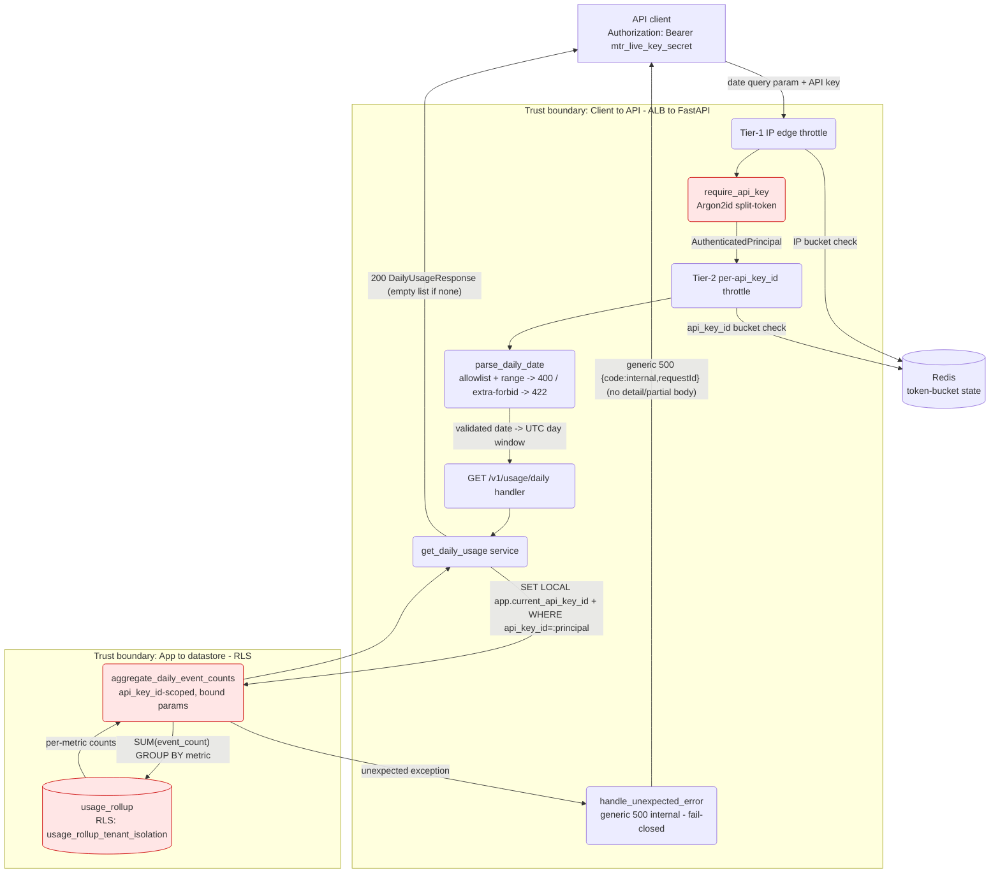

# Plan — GET /v1/usage/daily (per-metric daily event counts)

## Summary

Add a read-only endpoint `GET /v1/usage/daily?date=YYYY-MM-DD` that returns the
authenticated tenant's per-metric event counts for a single UTC day. The core
approach is to **aggregate the pre-computed `usage_rollup` counters** (summing the
existing hourly `event_count` over the day's 24 UTC hour-buckets, grouped by
`metric`) rather than `COUNT(*)`-scanning the raw `events` table — this is the same
"read the rollup, not the events" discipline `GET /v1/usage` already follows, so the
per-request cost stays bounded as ingest volume grows. The endpoint is delivered as a
**new sibling module trio** (`schemas/usage_daily.py`, `services/usage_daily_service.py`,
`routes/usage_daily.py`) plus one additive repository function and one `include_router`
line, so the code path of every existing endpoint — `POST /v1/events`, `GET /v1/usage`,
`GET /v1/usage/export`, `/v1/quotas` — is literally untouched and the brief's
no-behavior-change constraint is trivially auditable in the diff. Tenant scope is
derived **only** from the authenticated principal (`api_key_id`); the endpoint accepts
no `customer_id`/`api_key_id` input, which removes the IDOR parameter entirely.

The one deliberate deviation from house convention: the brief pins **HTTP 400** on a
malformed/missing `date`, whereas the codebase's Pydantic query models return 422. We
honor the brief (see *Backend → the 400-not-422 decision*).

## Scope (from the authoritative brief, `PROJECT.md`)

In scope:
- New `GET /v1/usage/daily?date=YYYY-MM-DD`: per-metric event counts for the
  authenticated customer for that UTC day.
- Existing API-key auth, **customer-scoped, NOT admin** (any authenticated key; no
  `admin` scope required).
- 400 on malformed/missing `date`; 200 with an **empty metrics list** (not 404) for a
  day with no events.
- No behavior change to `POST /v1/events` or any existing endpoint.
- pipeline-ci green on the PR (required merge check).

Out of scope (not planned): any change to write-path behavior; an optional `customer_id`
filter on the daily endpoint (the brief specifies only `date`); a new covering index /
migration (see *Data → why no migration*); pagination.

> Note on `.pipeline/requirements.md`: the file on disk is the interview for the
> **prior** quota-admin feature (already merged — see git log), not this one. Per the
> task instructions `PROJECT.md` is authoritative here; `requirements.md` is not treated
> as this feature's brief. Its non-functional defaults (no new perf budget beyond the
> API's existing p95 targets; operational usage data is non-sensitive) do, however,
> match this feature and are carried forward below.

## Backend

### Routing — a new sibling module, not an addition to `usage.py`

**What:** `GET /v1/usage/daily` lives in a brand-new `src/api/routes/usage_daily.py`
with its own `APIRouter`, mounted via one new `app.include_router(...)` line in
`src/main.py`. **Why (vs. adding a handler to `usage.py`):** the brief's hard constraint
is "no behavior change to any existing endpoint." Putting the new handler in a new module
means `GET /v1/usage`'s source is byte-for-byte unchanged, so the no-behavior-change
claim is verifiable by inspection of the diff rather than by reasoning about a shared
file — exactly the rationale `src/api/routes/usage_export.py` already records for being
its own module. **How:** the three static paths `/v1/usage`, `/v1/usage/export`,
`/v1/usage/daily` never collide (no path-param ambiguity), so router include order is
irrelevant.

The route composes dependencies with the **same sibling `_require_authenticated_and_throttled`**
helper the events/usage routes use — `require_api_key` (auth) then
`enforce_tier2_rate_limit` (post-auth per-`api_key_id` throttle), in that order. **Why
not the `_require_admin_and_throttled` gate** used by `/v1/quotas`: the brief says
customer-scoped, **not admin** — this is a read of the caller's *own* data, exactly like
`GET /v1/usage`, so it must be callable by any authenticated key (ingest or admin) with
no scope check. Reusing the admin gate would wrongly 403 an ingest key.

### Reading the data — aggregate `usage_rollup`, don't scan `events`

**What:** a new repository function `aggregate_daily_event_counts(session, *,
api_key_id, day_start, day_end)` in `src/repositories/usage_repo.py` runs one grouped
aggregate over `usage_rollup`:

```
SELECT metric, SUM(event_count) AS event_count
FROM usage_rollup
WHERE api_key_id = :api_key_id
  AND window_start >= :day_start
  AND window_start <  :day_end
GROUP BY metric
ORDER BY metric ASC
```

**Why the rollup and not `SELECT metric, COUNT(*) FROM events ...`:** `usage_rollup`
already holds `event_count` per `(api_key_id, customer_id, metric, hour)` bucket
(migration 0002), incremented atomically on each `POST /v1/events`. Summing that
pre-aggregate over a day's 24 hour-buckets is O(the tenant's rollup rows in that day),
whereas counting raw `events` is O(all the tenant's events ever) and grows without bound
as ingest scales — the precise cost the codebase's rollup design exists to avoid
(`usage_repo.py` module docstring; `usage_service.get_usage`). **How the counts map to
the brief:** `SUM(event_count)` collapses both the 24 hourly windows *and* every
`customer_id` under the tenant into one number per `metric`, which is exactly
"per-metric event counts for the authenticated customer for the given UTC day." The
result is a `list[DailyMetricCount]` (a new frozen dataclass in `usage_repo.py`:
`metric: str`, `event_count: int`), deterministically ordered by `metric` so the
response is stable and diff-testable (same discipline as the export's deterministic
`ORDER BY`). **Additive-only:** this is a new function beside `find_usage_rollup` /
`count_usage_rollups` / `stream_usage_rollups`; no existing function changes.

**Grouping by `metric` only (collapsing `customer_id`) — why:** the brief specifies
`date` as the sole query parameter and asks for "per-metric event counts," with no
`customer_id` in the request or the described output. Adding a `customer_id` breakdown
or filter would be scope creep beyond the brief. (Flagged as an open question below with
this as the proposed answer.)

### Tenant scoping / authorization

**What:** the query's first predicate is always `api_key_id = :api_key_id`, bound from
`principal.api_key_id` (never from client input), and it runs inside
`scoped_transaction(principal.api_key_id)`, which issues `SET LOCAL app.current_api_key_id`
so the PostgreSQL RLS policy `usage_rollup_tenant_isolation` (migration 0002) is the
defense-in-depth backstop. **Why this is IDOR-proof by construction:** the endpoint
exposes **no** object identifier in its input surface — no `customer_id`, no
`api_key_id`, no path id. There is nothing for an attacker to tamper with to pivot to
another tenant; the only tenant selector is the authenticated principal. **How it is
verified:** a two-tenant integration test (tenant B queries the same date after tenant A
ingests) asserts B sees its own empty result, never A's totals (mirrors
`test_usage_endpoint.py::test_cross_owner_cannot_read_anothers_usage`).

### The service layer

**What:** `src/services/usage_daily_service.py :: get_daily_usage(principal, params)`
orchestrates: (1) parse+validate the `date` (raising 400 — see below), yielding the UTC
`day_start`/`day_end` half-open window; (2) open `scoped_transaction`; (3) call
`aggregate_daily_event_counts`; (4) build `DailyUsageResponse`; (5) emit one structured
log event. **Why a service layer at all** (rather than inline in the route): it matches
the codebase's route→service→repository separation (`usage_service`, `events_service`,
`usage_export_service`), keeping the route a thin wiring layer and the DB/transaction
orchestration unit-substitutable.

### The 400-not-422 decision (the `date` validation contract)

**What:** `date` is bound as an **optional string field** on a Pydantic query model
`DailyUsageQueryParams(extra="forbid")`, and its value is validated by an **imperative
parser** `parse_daily_date(raw)` that raises `HTTPException(status_code=400, ...)` on a
missing, malformed, or out-of-range value. **Why this split** rather than a normal typed
Pydantic field: FastAPI maps Pydantic/type-coercion failures to **422** automatically
(the RequestValidationError handler in `errors.py`), which is the codebase's house
convention for every other endpoint. The brief, however, explicitly pins **400** for a
malformed/missing `date`. A strictly-typed `date` field (e.g. `datetime.date`) would
produce 422 on malformed input, and a *required* field would produce 422 on a missing
one — both contradicting the brief. So the field is typed loosely (`str | None = None`)
to let *structural* concerns (unknown params) still ride the 422 path while the
*date-value* contract is enforced imperatively and mapped to 400. **How the two error
codes stay cleanly separated:**

- Unknown/extra query param → `extra="forbid"` → 422 `validation_failed` (house
  convention, matches `UsageQueryParams`/`UsageExportQueryParams`; this is also the
  F4-01 undeclared-param contract — the endpoint declares exactly one param and rejects
  the rest).
- `date` missing / malformed / out-of-range → `parse_daily_date` → 400 `bad_request`
  (via the existing error-envelope status→code map, which already maps
  `400 → bad_request`).

`parse_daily_date` lives in `src/api/schemas/usage_daily.py` — the module's role in this
codebase is literally "the validation contract for this endpoint" (see the docstrings of
`schemas/usage.py` / `schemas/usage_export.py`); co-locating the parser with the
query-param model and the response models keeps the whole contract in one file and makes
it unit-testable with no DB/logging imports. Raising `HTTPException` from a non-route
module is already an established pattern here (`usage_export_service.prepare_export`
raises `HTTPException(422)`).

**The `date` contract, concretely:**
- Type: `str`.
- Format: anchored allowlist regex `^\d{4}-\d{2}-\d{2}$` (rejects `2026-7-1`, `2026/07/11`,
  trailing chars, embedded whitespace, empty string) — ReDoS-safe (fixed-width, no
  backtracking), then `datetime.date.fromisoformat(raw)` for calendar validity (rejects
  `2026-13-40`, `2026-02-30`).
- Range bound: the parsed date must fall in `[today_utc − 90 days, today_utc + 1 day]`;
  outside → 400. Mirrors the `[now−90d, now+1h]` idiom `usage.py`/`usage_export.py`
  already use, adapted to a calendar date. (See open questions — the exact lookback is a
  confirmable default, not a brief requirement.)
- Sink protected: the parsed `date` becomes `day_start`/`day_end` **datetimes** passed as
  **bound parameters** (`:day_start`, `:day_end`) into the aggregate SQL — the raw string
  never reaches SQL, so there is no injection sink.

### UTC day-boundary semantics

**What:** `day_start = datetime(y, m, d, tzinfo=UTC)`; `day_end = day_start + 1 day`;
the query uses the **half-open** interval `[day_start, day_end)`. **Why half-open and
UTC:** the codebase normalizes every window to UTC hour boundaries (`time_windows.floor_to_hour_utc`),
so a UTC day cleanly contains hour-buckets `00:00Z…23:00Z`; a half-open interval includes
`23:00Z` of day D and excludes `00:00Z` of D+1 with no double-counting at the seam.
**How verified:** a boundary integration test ingests at `23:xxZ` of D (counted) and at
`00:00Z` of D+1 (not counted).

### Response shape

`DailyUsageResponse(extra="forbid")`: `{ "date": "<echoed YYYY-MM-DD>", "metrics":
[ { "metric": str, "event_count": int }, … ] }`, metrics ordered by `metric`. Empty day
→ `metrics: []` with 200 (never 404) — same "absence is a valid answer, not an error"
contract `get_usage` documents (`extra="forbid"` on both models is the ASVS 15.3.1
minimal-projection posture; `api_key_id` is never echoed back).

### Safe-error / fail-closed behavior (unexpected internal errors)

**What:** an *unexpected* server-side failure on this route — the DB aggregate
`aggregate_daily_event_counts` raising mid-query, a connection drop, any exception that is
**not** one of the handled `HTTPException` cases above — is caught by the existing
centralized catch-all `handle_unexpected_error` in `src/api/errors.py` and returned as a
generic **500** `{ "error": { "code": "internal", "message": "an internal error occurred",
"requestId": … } }`; the full exception detail is written to the server log
(`request.unhandled_error`, with `exc_info`) and **never** to the response body. **Why (vs.
letting the exception propagate, or catching it in the route to build a bespoke error):**
this is the fail-closed boundary ASVS 16.5.1/16.5.3 requires — no stack trace, SQL text,
exception type/message, internal path, or `api_key_id` may reach the client, and the
request must fail *closed* (a generic 500), never fail *open* (a partial or
detail-leaking body). Because it is one central handler, the guarantee holds for every
route uniformly; the daily route and service therefore add **no** try/except of their
own — they raise and let the single boundary map it, identical to the sibling
`usage_export` path. **How verified:** a forced-error integration test monkeypatches
`aggregate_daily_event_counts` to raise and asserts a 500 generic `internal` envelope with
`requestId` present and no leaked detail or partial body — a direct mirror of
`test_usage_export_endpoint.py::test_export_forced_pre_flight_count_error_returns_generic_500`
(AC15 here; AC22 there).

## Stack notes

This is an existing project with an established, `CLAUDE.md`-recorded stack; this feature
introduces **no stack change and no new dependency**, so every default is endorsed as-is:

- **Language/framework: Python 3.12 + FastAPI** — kept; a standard FastAPI route reusing
  the existing router/dependency/schema patterns.
- **Data store: PostgreSQL** — kept; reads the existing `usage_rollup` table via the
  existing async SQLAlchemy session + RLS machinery. No new table, no migration (Alembic
  untouched).
- **Auth: API keys (Argon2id, split-token), customer-scoped** — kept; reuses
  `require_api_key` verbatim, no third-party IdP, no scope change.
- **Observability: structlog → CloudWatch/X-Ray + Sentry** — kept; one new structured
  `usage.daily.read` event through the existing logger facade.
- **Rate limiting: Redis token bucket (Tier-1 IP / Tier-2 per-key)** — kept; reused via
  the existing dependency + middleware.

**One conscious contract deviation** (flagged for the checkpoint, not a stack change): this
endpoint returns **HTTP 400** for a malformed/missing `date`, whereas the codebase's
Pydantic query models otherwise surface validation failures as 422. The brief pins 400;
the split (400 for the date *value*, 422 for *undeclared params*) is detailed in
*Backend → the 400-not-422 decision*.

## Auth

Reuses the existing API-key facade unchanged: `require_api_key`
(`src/auth/__init__.py`) parses the split-token `Authorization: Bearer
mtr_live_<key_id>_<secret>` header, verifies it (Argon2id, with the in-process
verification cache), and yields the `AuthenticatedPrincipal`. Missing/malformed/unknown
key → 401. No new auth code; the endpoint only *depends on* the existing guard. The
route is **customer-scoped (not admin)** — no `scope` check — so any authenticated key
may read its own daily summary. (The `mtr_live_<key_id>_<secret>` / `Bearer` auth
context is restated here so the DAST scanner config — and `test_dast_context_documented`
can read it from the plan.)

## Logging

**What:** one structured event per request, emitted from the service after the read:
`logger.info("usage.daily.read", userId=principal.api_key_id, action="read",
resource="usage_rollup", date=<echoed date>, metricCount=len(metrics))`. **Why these
fields / this shape:** it mirrors the existing `usage.read` and `usage.export` events
(same `userId`/`action`/`resource` vocabulary), so operators get a consistent read-audit
line, correlated to the per-request `requestId` the `RequestContextMiddleware` already
injects. **PII:** none logged — `userId` is the internal tenant id (already the standard
identifier in these logs), and **no `customer_id` values or metric *values* are logged**
(only the *count* of metrics), honoring `logging-conventions`' redaction rule. An
*unexpected* failure is logged once, server-side only, by the central
`handle_unexpected_error` (`request.unhandled_error`, `exc_info`) — see *Backend →
Safe-error / fail-closed behavior*; the client still gets only the generic 500 envelope.

## Data / migrations

**No schema change, no migration.** The endpoint reads the existing `usage_rollup` table
via the existing `scoped_transaction` + RLS machinery. **Why no new index** (an
attractive option: a covering index `(api_key_id, window_start, metric)` would turn the
daily query from an `api_key_id`-prefix scan into a tight day-range scan): adding an
index to `usage_rollup` would add index-maintenance cost to **every `POST /v1/events`
upsert** — brushing directly against the brief's "no behavior change to `POST /v1/events`"
constraint (write latency would move, even if behavior wouldn't). The daily query's cost
is already bounded — it is scoped by `api_key_id` first (the same accepted
`api_key_id`-prefix scan the export's `count_usage_rollups` relies on), it aggregates a
single day, and it is rate-limited per key. So we deliberately **defer** the index to a
future optimization and keep the write path's index set unchanged. (Recorded as an open
question / future note, not a silent omission.)

**No new stored data → `data-protection-conventions` not triggered.** This is a pure
read; it persists nothing. The data it reads (`usage_rollup`: opaque `customer_id`,
`metric`, counts) is non-sensitive operational metering config — the same classification
the prior feature's interview recorded ("non-sensitive operational config"). No field
needs an at-rest control here because no field is written.

## Skills consulted

- **api-edge-conventions** — HTTP surface + DoS. Confirms the reuse posture: the new
  route inherits the middleware edge stack (security headers, CORS, body-size guard,
  Tier-1 IP throttle) and adds the Tier-2 per-principal throttle via the sibling
  dependency. Input-surface controls emitted below. Also confirms the error-envelope
  facade reuse (generic 500 fail-closed via `handle_unexpected_error`).
- **logging-conventions** — the `usage.daily.read` event shape + PII redaction (above).
- **dast-conventions** — the served OpenAPI schema must include the new route with its
  response model; reuses the existing seeded DAST test user + Bearer auth context. ACs
  emitted (AC14).
- **test-conventions / code-standards** — route→service→repository split, facade reuse,
  anchored input allowlist, parameterized SQL, `extra="forbid"` response projection.
- **audit-trail-conventions / regulated-data-conventions — NOT in scope.** The data read
  is per-metric event *counts* over opaque tenant-supplied identifiers — operational
  metering data, not PHI, financial records, payment-card, or regulated PII. No
  compliance regime is named in `PROJECT.md`/`CLAUDE.md`. The existing usage reads emit a
  structured `usage.read` log with **no** per-record access trail, and this endpoint
  follows that same posture; a HIPAA/SOC2-style per-record audit trail is not warranted.
- **secrets-management — no change.** No new runtime credential is consumed; the DB URL
  is already fetched via `src/config/secrets.py`.
- **data-lifecycle / iac / containerization / observability — no change.** No personal
  data stored, no infra provisioned, no packaging change, no new SLO.

**New dependencies:** none. (Nothing for `dependency-audit-policy` to review.)

## Files affected

| File | New/Mod | Reason |
|---|---|---|
| `src/api/schemas/usage_daily.py` | new | `DailyUsageQueryParams` (`extra="forbid"`, `date: str \| None`), `parse_daily_date` (strict parse + range bound → 400, returns UTC day window), `DailyMetricCount`/`DailyUsageResponse` response models. |
| `src/services/usage_daily_service.py` | new | `get_daily_usage(principal, params)` — parse date, scoped transaction, repo call, response build, `usage.daily.read` log. Adds no error-swallowing try/except: unexpected failures propagate to the central fail-closed 500 boundary. |
| `src/api/routes/usage_daily.py` | new | `GET /v1/usage/daily` route; `_require_authenticated_and_throttled` sibling (auth → Tier-2), `response_model=DailyUsageResponse`. Keeps existing routes untouched. |
| `src/repositories/usage_repo.py` | mod (additive) | Add `aggregate_daily_event_counts(...)` + `DailyMetricCount` dataclass; existing functions unchanged. |
| `src/main.py` | mod (additive) | One `app.include_router(usage_daily_router)` line; nothing else changes. |
| `tests/integration/test_usage_daily_endpoint.py` | new | Endpoint behavior against real Postgres: happy path, empty-day, day-boundary, cross-tenant, non-admin, 401, and the forced-internal-error generic-500 fail-closed path (AC15). |
| `tests/test_schemas_usage_daily.py` | new | Unit: `parse_daily_date` (valid/missing/malformed/out-of-range), day-bounds (month rollover, leap year), `extra="forbid"`, response-model shape. |

(Directory `README`/doc updates for touched dirs are handled by the documentation stage,
not implementation-authored code, so they are not in the code change set above.)

## Test strategy

**Shape: `pyramid`** (default). The bulk of the branch surface is *local* validation
logic — the `date` format/calendar/range contract and the UTC day-bounds computation —
which is exhaustively covered by fast **unit** tests in `tests/test_schemas_usage_daily.py`
(valid, several malformed forms, missing, out-of-range past/future, leap-year and
month-rollover boundaries, unknown-param rejection at the model, response-model
`extra="forbid"`). A smaller set of **integration** tests
(`tests/integration/test_usage_daily_endpoint.py`, real Postgres via the existing
fixtures) covers what only a DB can prove: multi-bucket/multi-customer aggregation
correctness, the empty-day 200-empty-list, the UTC day-seam boundary, cross-tenant
isolation (IDOR), non-admin access, 401, and the **forced-internal-error generic-500
fail-closed path** (AC15 — monkeypatch `aggregate_daily_event_counts` to raise, assert a
500 `internal` envelope with no leaked detail or partial body, mirroring the sibling
export test). No E2E tier. Coverage must clear the project's **≥85% branch** gate
(`pytest --cov=src --cov-branch`), and the existing suite must remain green unchanged
(no-regression, AC11). This satisfies the pipeline-ci required check.

**Task decomposition:** the estimated change set is **7 files (< 8)**, so per the
F-M4′-1 default this builds **single-shot** from this plan — no `tasks.md` is emitted.

## Open questions (proposed answers in brackets — confirm at checkpoint)

1. **Grouping granularity.** The brief says "per-metric event counts" with only a `date`
   param, so the plan groups by `metric` alone, collapsing all `customer_id`s under the
   tenant. **[Proposed: yes — metric-only, no `customer_id` filter/breakdown; an optional
   `customer_id` filter is a clean future addition but out of scope for this brief.]**
2. **Date lookback bound.** The plan bounds `date` to `[today_utc − 90d, today_utc + 1d]`
   for input sanity and consistency with the sibling endpoints. Because the daily query's
   cost is one day regardless of how far back the date is, this bound could safely be
   relaxed (longer history). **[Proposed: keep 90 days to match `GET /v1/usage` /
   `/v1/usage/export`; revisit if product wants longer historical daily summaries.]**
3. **Is an out-of-range (well-formed) date a 400 or a 404/empty-200?** The brief pins 400
   only for "malformed or missing." The plan treats out-of-range as **400 `bad_request`**
   (a single, consistent "the `date` value is unacceptable" contract). **[Proposed: 400.]**
4. **Deferred covering index.** No index is added, to keep the `POST /v1/events` write
   path's index set (and latency) unchanged. **[Proposed: accept the `api_key_id`-prefix
   scan now (bounded + rate-limited); add `(api_key_id, window_start, metric)` in a
   follow-up only if daily-summary latency becomes a problem at scale.]**

## Acceptance-criteria trace (`CLAUDE.md` "What done means")

| "Done" criterion | Where addressed |
|---|---|
| Smoke check passes | No import-time DB/Redis connection added (lazy engine preserved); new route mounts cleanly at construction — smoke `import src.main` + `/health` 200 unaffected. |
| Security report clean | STRIDE + ASVS blocks below; parameterized SQL, `api_key_id`-first scope + RLS, anchored `date` allowlist, error envelope reused (incl. the generic-500 fail-closed boundary, AC15). |
| Tests pass at ≥85% coverage | Test strategy above (unit-heavy over the validation branches + integration for DB behavior, incl. the forced-error 500 path). |
| Docs updated for touched dirs | Handled at the documentation stage (READMEs for `src/api/routes`, `src/services`, `src/repositories`, `src/api/schemas`). |
| PR description written | Produced downstream; pipeline-ci required check must be green (AC-level: existing suite + new tests + coverage gate). |

The full traceable, id'd criteria are in `.pipeline/acceptance.md`.

## Threat Model

### Assets and trust boundaries

**Assets**
- The tenant's per-metric **daily event counts** (commercially sensitive to the tenant —
  reveals their business volume); the underlying `usage_rollup` aggregates.
- The API-key credential presented in `Authorization`.
- The `date` query input (untrusted).

**Trust boundaries**
- **Client ↔ API** (untrusted internet → ALB → FastAPI): where the API key and the
  `date` string cross. All input validation and authN/authZ happen here.
- **API ↔ PostgreSQL** (app ↔ datastore): the RLS boundary; `SET LOCAL
  app.current_api_key_id` gates row visibility.
- **API ↔ Redis** (rate-limit token-bucket state): the Tier-1/Tier-2 throttle store.

### ASVS Compliance

**Triggered chapters:** V1 (Encoding & Sanitization — parameterized SQL), V2 (Validation
+ anti-automation), V4 (API), V6 (Authentication — API key, reused), V8 (Authorization —
tenant/object-level isolation; the primary chapter here), V11 (Cryptography — Argon2id
key verification, reused), V13 (Configuration — least-privilege/RLS), V16 (Security
Logging & Error Handling). **n/a:** V3 (no web frontend), V5 (no file handling), V7 (no
sessions), V9/V10 (no JWT/OAuth), V12 (TLS terminated at ALB — infra, reused), V14 (no
new stored data), V15/V17 (no matching surface beyond resource-exhaustion, covered under
V2/V4).

**In-scope L3:** none newly introduced by this read. The reused auth path's L3 item
already met by the codebase — 11.2.4 constant-time secret comparison (the verification
cache's `constant_time_equals`) — continues to apply; this feature adds no new L3
obligation.

**Waivers:** none. (No triggered L1/L2 code/config item is unmet.)

### STRIDE threats

| Category | Asset / Boundary | Attack vector | Sev | Mitigation (mechanism + file + enabling condition) | ASVS |
|---|---|---|---|---|---|
| **Spoofing** | API key / Client↔API | Unauthenticated caller reads a tenant's usage | H | `require_api_key` dependency composed via `_require_authenticated_and_throttled` in `src/api/routes/usage_daily.py`; split-token parse (anchored `_TOKEN_PATTERN`) + Argon2id verify in `src/auth/api_key.py`; missing/bad key → 401. Enabling condition: the route depends on `require_api_key` **before** the handler runs, so no code path serves data pre-auth. | V6 (6.2.x) |
| **Tampering** | `date` input / Client↔API | Injection or malformed value via `date`; SQLi into the rollup query | M (H if unmitigated) | `parse_daily_date` in `src/api/schemas/usage_daily.py`: anchored `^\d{4}-\d{2}-\d{2}$` allowlist + `date.fromisoformat` calendar check + `[now−90d, now+1d]` bound → 400. The value never reaches SQL as text — it is converted to `day_start`/`day_end` datetimes passed as **bound params** (`:day_start`,`:day_end`) in `aggregate_daily_event_counts` (`src/repositories/usage_repo.py`). Enabling condition: no f-string/concat of any caller value into the SQL text. | V2 (2.x), 1.2.4 |
| **Tampering** | Query surface / Client↔API | Smuggling an unexpected param (e.g. `api_key_id`, `customer_id`) to widen scope | M | `DailyUsageQueryParams(extra="forbid")` bound via `Annotated[..., Query()]` in `src/api/schemas/usage_daily.py` rejects any undeclared query param → 422. Enabling condition: the model is the *only* query binding; the route reads nothing off `request.query_params` directly. | 15.3.x |
| **Repudiation** | Read action / app↔datastore | Caller denies having pulled the data | L | `logger.info("usage.daily.read", userId=api_key_id, action="read", resource="usage_rollup", date=…)` in `src/services/usage_daily_service.py`, correlated to `requestId` from `RequestContextMiddleware`. Enabling condition: emitted after the read on the success path. (App-level log, not a regulated per-record trail — data is non-sensitive.) | V16 (16.2.x) |
| **Information Disclosure** | Tenant counts / Client↔API + app↔datastore | Cross-tenant read (IDOR/BOLA) — seeing another tenant's counts | H | `WHERE api_key_id = :api_key_id` (from `principal`, never client input) as the first predicate in `aggregate_daily_event_counts`; **plus** RLS policy `usage_rollup_tenant_isolation` (migration 0002) enforced via `SET LOCAL app.current_api_key_id` in `scoped_transaction` (`src/db/session.py`). Enabling condition: the endpoint accepts **no** object id, so there is no IDOR parameter; the RLS setting is transaction-local and set before the query. | 8.2.2 |
| **Information Disclosure** | Error/response body | Stack trace / SQL / `api_key_id` leaking in a response, or an *unexpected* internal error failing *open* with partial/detail-leaking output | M | Central error envelope (`src/api/errors.py`) returns generic `{code,message,requestId}`, never stack/SQL; the catch-all `handle_unexpected_error` maps **any unexpected exception** (e.g. a repo/DB failure) to a generic **500 `internal`** — fail-closed, no partial body, full detail logged server-side only; `DailyUsageResponse(extra="forbid")` projects only `date`+`metrics` (no `api_key_id`). Enabling condition: route **and** service raise and never build their own error body or catch-and-swallow, so the single boundary owns every error response. Verified by AC15 (forced-error 500). | 16.5.1, 16.5.3, 15.3.1 |
| **Denial of Service** | Rollup query / Redis | Expensive/unbounded query or request flood | M | (a) single-day `GROUP BY` over the pre-aggregated `usage_rollup`, `api_key_id`-scoped (bounded per-tenant rows); (b) `[now−90d, now+1d]` date bound rejects absurd dates; (c) **Tier-2** per-`api_key_id` token bucket via `enforce_tier2_rate_limit` (`src/auth/rate_limit.py`); (d) **Tier-1** IP+route edge throttle via `Tier1EdgeThrottleMiddleware` (`src/main.py`). Enabling conditions: Tier-2 is keyed on `principal.api_key_id` because it runs **after** `require_api_key` (dependency ordering); Tier-1 derives client IP behind the ALB via the middleware's existing forwarded-header handling; health probes are exempt (existing). | 2.4.x, V4 |
| **Elevation of Privilege** | Scope / authorization | A low-privilege (ingest) key gaining data it shouldn't; scope confusion | L | By design there is nothing to escalate: the endpoint returns **only the caller's own** tenant data and requires no special scope. Mechanism: it depends on `require_api_key` only (no `_require_admin` gate), and accepts no `customer_id`/`api_key_id`, so an ingest key cannot pivot to another tenant or to admin data. Enabling condition: customer-scope-only is intentional (contrast `/v1/quotas`, which adds the admin gate). | 8.1.x |

### Accepted risks / out of scope

- **No covering index** on `usage_rollup` for this access pattern — the `api_key_id`-prefix
  scan is accepted (bounded per-tenant rows + rate limits); deferring the index keeps the
  `POST /v1/events` write path unchanged (see Data). Revisit if latency degrades at scale.
- **~5-min API-key revocation latency** from the existing in-process verification cache is
  an accepted, pre-existing risk (documented in `src/auth/__init__.py`), inherited
  unchanged — not introduced or widened here.
- **Tier-2 fails open on a Redis outage** (existing, documented behavior) — a cache outage
  degrades to "temporarily unthrottled reads," preferred over an availability outage;
  inherited unchanged.

### Threat-model diagram (Mermaid DFD)



⚠ High-severity nodes: **Auth** (Spoofing), **Repo + usage_rollup** (cross-tenant
Information Disclosure / IDOR).

### Copy-paste visualization prompt

```text
You are a threat-modeling assistant. Build a data-flow threat diagram for this feature.

FEATURE: GET /v1/usage/daily?date=YYYY-MM-DD — a read-only HTTP endpoint (FastAPI /
PostgreSQL) returning per-metric event counts for the authenticated API-key tenant for
one UTC day. It reads the pre-aggregated `usage_rollup` table (SUM(event_count) GROUP BY
metric over the day's 24 UTC hour-buckets). Auth is an existing API-key scheme
(Authorization: Bearer mtr_live_<key_id>_<secret>, Argon2id-hashed at rest),
customer-scoped (any authenticated key; NOT admin). The endpoint accepts no
customer_id/api_key_id — tenant scope is derived solely from the authenticated principal.

ASSETS:
- The tenant's per-metric daily event counts (commercially sensitive) and the usage_rollup aggregates.
- The API-key credential in the Authorization header.
- The untrusted `date` query string.

TRUST BOUNDARIES:
- Client <-> API (internet -> ALB -> FastAPI): API key + `date` cross here; authN/Z and validation happen here.
- API <-> PostgreSQL (app <-> datastore): RLS boundary via SET LOCAL app.current_api_key_id.
- API <-> Redis: Tier-1/Tier-2 rate-limit token-bucket state.

STRIDE TABLE (threat | vector | severity | mitigation + concrete mechanism):
- Spoofing | unauthenticated caller reads usage | High | require_api_key dependency (split-token anchored regex + Argon2id verify) runs before the handler; 401 on failure.
- Tampering | malformed/injection via `date` | Medium(High if unmitigated) | anchored allowlist ^\d{4}-\d{2}-\d{2}$ + date.fromisoformat + [now-90d,now+1d] bound -> 400; value converted to datetime bound params (:day_start/:day_end), never concatenated into SQL.
- Tampering | smuggling an unexpected query param to widen scope | Medium | Pydantic query model with extra="forbid" -> 422; route reads only the bound model.
- Repudiation | caller denies the read | Low | structured usage.daily.read log (userId=api_key_id, action=read, date) correlated to requestId.
- Information Disclosure | cross-tenant read (IDOR/BOLA) | High | WHERE api_key_id=:principal (never client input) as first predicate + PostgreSQL RLS policy usage_rollup_tenant_isolation via SET LOCAL; endpoint exposes no object id to tamper with.
- Information Disclosure | stack/SQL/api_key_id leak, or an unexpected internal error failing open | Medium | central error envelope (generic code/message/requestId); catch-all handle_unexpected_error maps any unexpected exception to a generic 500 "internal" (fail-closed, no partial body, detail logged server-side only); response model extra="forbid" (no api_key_id echoed).
- Denial of Service | expensive/unbounded query or flood | Medium | single-day GROUP BY over pre-aggregated rollup, api_key_id-scoped; date range bound; Tier-2 per-api_key_id token bucket (post-auth) + Tier-1 IP edge throttle (Redis).
- Elevation of Privilege | ingest key accessing more than its own data | Low | customer-scope-only (no admin gate), no customer_id/api_key_id input -> nothing to escalate to.

Render this as an OWASP Threat Dragon diagram. Output either (a) valid Threat Dragon JSON
importable at app.threatdragon.com, or (b) a labeled data flow diagram with trust
boundaries if JSON is not feasible. No additional context is available beyond what is in
this prompt.
```

## Revision notes

Single bounded revision pass (2026-07-11) closing the one `[material]` flag in
`.pipeline/plan-audit.md` — **no other scope touched, no settled decision reopened.**

- **Missing safe-error / fail-closed acceptance criterion (ASVS-DET T2-2).** The endpoint
  has a real server-side error surface (a DB aggregate call) but `acceptance.md` carried
  no criterion asserting that an *unexpected* internal error returns a generic 500 envelope
  rather than leaking internals or failing open — while the sibling `usage_export` endpoint
  already carries exactly this test
  (`test_export_forced_pre_flight_count_error_returns_generic_500`). Closed by:
  - **`acceptance.md`:** added **AC15** (safe-error / fail-closed: forced
    `aggregate_daily_event_counts` failure → generic 500 `internal` envelope, no
    stack/SQL/detail/partial-body leak, verified by a new
    `test_daily_forced_repo_error_returns_generic_500` mirroring the export sibling).
    Bumped `criteria_total` 14 → 15. `delegated_criteria` stays `[]` — the criterion is
    test-verifiable, not delegated to the security stage.
  - **`plan.md` → Backend:** added the *Safe-error / fail-closed behavior* subsection making
    the reused central `handle_unexpected_error` boundary explicit (route/service raise and
    never catch-and-swallow; detail logged server-side only).
  - **`plan.md` → STRIDE:** extended the *Information Disclosure (error/response body)* row's
    mechanism + enabling condition to cover the unhandled-exception 500 path (ASVS 16.5.1 /
    16.5.3), added an `Err` node + failure edge to the Mermaid DFD, and noted the fail-open
    case in the copy-paste prompt.
  - **`plan.md` → Test strategy / Files affected / Logging:** named the forced-error
    integration test and its file, and noted the server-side-only failure log, so AC15 is
    traceable end-to-end.
