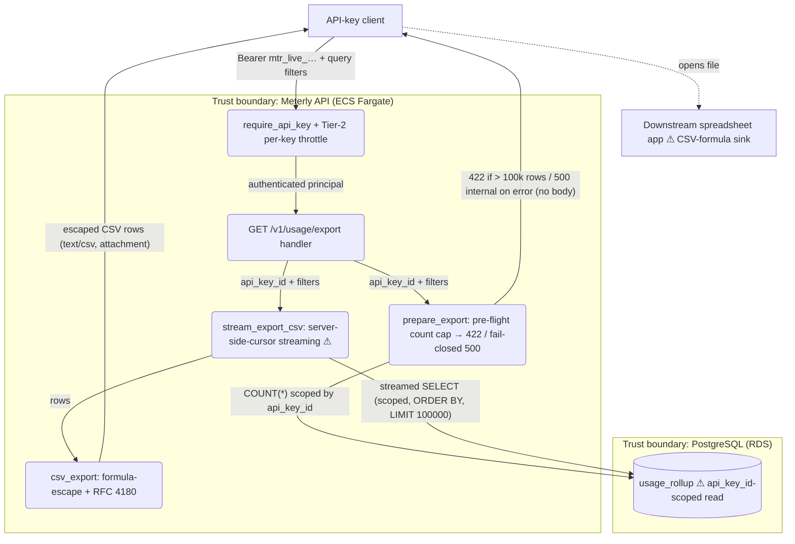

# Plan — usage CSV export (`GET /v1/usage/export`)

## Summary

We add one read-only endpoint, `GET /v1/usage/export`, that streams the authenticated
caller's own `usage_rollup` rows as an RFC 4180 CSV (`customer_id,metric,window_start,
total_quantity`), with optional `customer_id` / `metric` / `from` / `to` filters, a hard
100,000-row cap, and OWASP CSV-formula-injection escaping at the encoding boundary. The
core approach is a **streaming response backed by a PostgreSQL server-side cursor inside a
tenant-scoped transaction**, chosen over buffering the whole result in memory because a
100k-row export buffered per concurrent request is a cheap memory-exhaustion (DoS) vector,
and over pagination because the brief scoped size control to "row cap + filters, no
pagination this slice." The feature reuses every existing edge control (API-key auth,
Tier-2 per-key throttle, security headers, error envelope, structured logging, RLS
backstop) and reuses the exact validated identifier types the ingest/query paths already
enforce — so it adds a new HTTP surface without a new auth mechanism, a new migration, or
any change to the existing endpoints. It is intentionally isolated in new modules so the
existing `GET /v1/usage` code path is untouched (the brief's no-behavior-change constraint).

The authoritative brief (`.pipeline/requirements.md`) resolved nearly everything; its one
`Open` item (the documented p95 target number) is carried below as Open Question 1 with a
stated default (p95 < 500 ms at the cap). Everything in the brief's `Out of scope` list
(pagination, admin-only gating, other formats/compression/async jobs, changes to existing
endpoints, extra audit logging) is treated as a hard exclusion and not planned.

## Stack notes

The feature sits entirely inside Meterly's existing stack; every default was assessed and
kept — none swapped.

- **Backend — Python 3.12 / FastAPI (kept).** The endpoint is one more FastAPI route on the
  existing app; mirrors the proven `GET /v1/usage` composition. No reason to deviate.
- **CSV encoding — Python stdlib `csv` (kept, and mandated by the brief).** *What:* use
  `csv.writer` with an explicit RFC 4180 dialect. *Why over a hand-rolled encoder:* a
  hand-rolled encoder is the classic source of quoting bugs (a value containing a comma,
  quote, or embedded newline breaks a naive `",".join(...)`), and getting RFC 4180 quoting
  exactly right is precisely what stdlib `csv` already does and is tested to do. *How:*
  `csv.writer` with `lineterminator="\r\n"` (RFC 4180 CRLF) and `QUOTE_MINIMAL` (quote only
  fields containing comma/quote/CR/LF) writing into a per-row `io.StringIO` we drain and
  reset each row — this reuses stdlib correctness while keeping constant memory (we never
  hold more than one row's text). Formula-injection escaping is applied to text cells
  *before* they reach the writer (see the CSV-encoding section).
- **Data store — PostgreSQL (kept), read-only, no migration.** The export reads the
  existing `usage_rollup` aggregate. No new table, column, index, or data-classification
  surface — consistent with the brief's "no new stored data." See Data section for the
  ordering/index tradeoff this creates and why we still add no migration.
- **Streaming — Starlette `StreamingResponse` + SQLAlchemy async `session.stream()` (new
  use of an existing capability).** Assessed against buffering and against chunked keyset
  pagination; the server-side-cursor-in-one-transaction option won on simplicity +
  single-snapshot consistency. Full rationale in the Backend section.
- **Auth — existing API-key facade (kept).** Any authenticated key may export its own
  tenant's data (brief: not admin-gated). Reuses `require_api_key` + the Tier-2 per-key
  throttle exactly as `GET /v1/usage` does.
- **Observability / logging — structlog facade + CloudWatch/X-Ray/Sentry (kept).** One new
  `usage.export` audit event through the existing `get_logger()` facade; no new SLO or
  burn-rate alarm for this reporting slice (the binding perf criterion is a documented p95
  sanity check, not an SLO — see Open Question 1).
- **Infra / IaC — no change.** No provisioned resource is added; the route ships through the
  existing CI → build-provenance → `deploy.yml` chain with no `infra/` edit. (The `infra/`
  files marked modified in the working tree belong to earlier work on this branch, not this
  feature.)

No default is being recommended against; nothing here needs a checkpoint override on stack
grounds.

## Backend — route, service, repository

### Route — `src/api/routes/usage_export.py` (new module)

*What:* a new router module exposing `GET /v1/usage/export`, registered in `src/main.py`.
*Why a new module rather than adding to `src/api/routes/usage.py`:* the brief requires "no
behavior change to any existing endpoint"; putting the export in its own module keeps
`usage.py` (which owns `GET /v1/usage`) literally untouched, making the no-change guarantee
trivially auditable in the diff, and matches the existing per-resource module convention
(`events.py`, `usage.py`, `quotas.py`). *How:* it reuses the same sibling dependency the
other routes use to pin ordering —

- `_require_authenticated_and_throttled` (auth `require_api_key` → Tier-2 per-key throttle,
  in that order) — copied as a sibling, not imported, per the established convention that
  each route's dependency chain stays independently readable. No admin-scope gate (any
  authenticated key may export — brief resolved).

The handler is deliberately two-phase to make the row cap a clean pre-body 422:

1. **Pre-flight cap check (still a normal request, can 422 cleanly).** Call the service's
   `prepare_export(principal, params)`, which runs a `COUNT(*)` with the same filters inside
   a tenant-scoped transaction and raises `HTTPException(status_code=422, detail=...)` if the
   count exceeds 100,000. 422 already maps to `validation_failed` in `src/api/errors.py`'s
   `_STATUS_TO_CODE`, so this needs no `AppError` — a plain `HTTPException(422)` yields the
   brief-required `{"error":{"code":"validation_failed",...}}` envelope. *Why a pre-flight
   count and not "stream until the 100,001st row":* once we return a `StreamingResponse` the
   status line is already `200` and the first bytes may be on the wire — we cannot retro-send
   a 422. The cap decision must therefore precede any response body. The count is an
   index-prefix scan over the caller's `api_key_id` and is cheap.
   *Fail-closed on a non-cap error (AC22):* any **unexpected** error raised during this
   pre-flight `COUNT` phase — a DB connection drop, a query error — is deliberately **not**
   caught and **not** a 422. It propagates uncaught to the catch-all
   `@app.exception_handler(Exception)` boundary in `src/api/errors.py`, which returns the
   generic `500` envelope (`{"error":{"code":"internal","message":"an internal error
   occurred","requestId":...}}` — no stack, SQL, or internal path leaked, ASVS 16.5.x), with
   the pre-flight transaction rolled back and **no `StreamingResponse` ever constructed**, so
   no partial body is emitted. This phase is *cleanly recoverable* precisely because it runs
   before any response byte — it is the failure path AC22 exercises, distinct from R3's
   post-200 mid-stream case where the envelope can no longer apply.
2. **Stream.** Return `StreamingResponse(stream_export_csv(principal, params),
   media_type="text/csv; charset=utf-8", headers={"Content-Disposition": 'attachment;
   filename="usage-export-<UTC>.csv"'})`. The generator is consumed by Starlette *after* the
   handler returns, so it opens its **own** tenant-scoped transaction (see below).

The route also declares explicit OpenAPI `responses=` metadata (`200 -> text/csv`, `422 ->
validation_failed` envelope) so the served schema describes the streamed route accurately
(a `StreamingResponse` has no auto `response_model`) — this is what makes DAST-1 true.

Query-param binding mirrors `GET /v1/usage`: `params: Annotated[UsageExportQueryParams,
Query()]`.

### Query schema — `src/api/schemas/usage_export.py` (new file)

*What:* `UsageExportQueryParams(BaseModel)` with `extra="forbid"`, all fields optional:
- `customer_id: CustomerId | None = None` and `metric: Metric | None = None` — **reusing the
  exact `constr` allowlists** from `src/api/schemas/events.py` (`^[A-Za-z0-9_.:-]{1,128}$` /
  `{1,64}$`). *Why reuse rather than re-declare loosely:* these are the same identifiers over
  the same SQL sink, so the validation contract must be identical to the ingest/query path;
  importing the shared `constr` types keeps the anchored-allowlist charset in one place.
- `from_: AwareDatetime | None = Field(default=None, alias="from")` and
  `to: AwareDatetime | None = None`, with `populate_by_name=True`. *Why the alias:* `from` is
  a Python keyword, so the field is `from_` bound to the `from` query name. `AwareDatetime`
  rejects naive datetimes (the existing idiom — a naive value would silently mis-attribute a
  window), and a `model_validator` enforces `from <= to` and both within `[now-90d, now+1h]`,
  reusing the same `_MAX_WINDOW_LOOKBACK` / `_MAX_WINDOW_LOOKAHEAD` bounds `usage.py` uses.
- `extra="forbid"` so an unknown query param (typo, probe, or a client-supplied `api_key_id`)
  is rejected 422 rather than silently ignored — the same mass-assignment posture the write
  schemas use, applied to a read.

A new file (not an edit to `usage.py`'s schema) keeps the existing `UsageQueryParams`
untouched.

### Service — `src/services/usage_export_service.py` (new)

Two public coroutines plus two module constants:

- `MAX_EXPORT_ROWS = 100_000`, `EXPORT_COLUMNS = ("customer_id","metric","window_start",
  "total_quantity")`.
- `async def prepare_export(principal, params) -> None` — opens `scoped_transaction(
  principal.api_key_id)`, calls `count_usage_rollups(...)`, raises `HTTPException(422,
  "result exceeds 100000 rows; narrow with customer_id, metric, from, and/or to")` when over
  cap; logs the rejection at `warn` (`usage.export.rejected`, `reason="row_cap_exceeded"`).
  Any **other** (non-cap) exception it raises — e.g. a DB error from the `COUNT` — is left to
  propagate to the error-envelope boundary (`500 internal`, fail-closed, transaction rolled
  back, before any response byte); it is deliberately **not** swallowed or masked as a 200
  (AC22 verifies this safe-error shape and that no stream is started).
- `async def stream_export_csv(principal, params) -> AsyncIterator[bytes]` — the body
  generator. *This is the load-bearing streaming design:*
  - It opens its **own** `scoped_transaction(principal.api_key_id)` and does all DB work
    inside it. *Why inside the generator, not the handler:* Starlette pulls the generator
    after the handler returns, so a transaction opened in the handler would already be closed
    when the first row is read. Opening it in the generator keeps two invariants alive for the
    whole stream: (a) the `SET LOCAL app.current_api_key_id` that arms the RLS backstop is in
    force for every streamed read, and (b) the server-side cursor stays valid.
  - It yields the **header row first, always** (so an empty result is a 200 header-only CSV,
    never a 404 — mirrors the existing zeros-not-404 contract), then `async for record in
    stream_usage_rollups(..., limit=MAX_EXPORT_ROWS)` yields one CSV-encoded row at a time.
  - Constant memory: each row is encoded into a reused `io.StringIO`, `.getvalue()` is
    yielded as UTF-8 bytes, then the buffer is truncated — we never hold more than one row's
    text, and `session.stream()` fetches from the DB via a server-side cursor rather than
    buffering the whole result client-side.
  - In a `finally`, it emits exactly one `usage.export` audit log (row count, `capped`,
    `completed`) — placed in `finally` so a client disconnect mid-stream still records what
    was sent. Structlog contextvars (`requestId`/`traceId`) are still bound here because the
    body iteration runs in the same request task.

*Why a single server-side-cursor transaction rather than chunked keyset pagination:* the
brief scoped this to "streaming response, rows written as read." A single transaction gives
one consistent snapshot and simple, correct code. The cost is a real operability tradeoff:
the DB transaction/connection is held open for the duration of the (possibly slow) client
download, so a slow reader can pin a pooled connection. That blast radius is bounded three
ways — the 100k row cap + `LIMIT 100000` bounds the stream, the Tier-2 per-key throttle
bounds how many exports one key starts, and the connection pool is sized for it. If
connection-hold ever proves problematic under load, the follow-up is batched keyset
pagination (short transaction per batch) — noted, not built this slice (accepted risk R1).

*Streaming-through-middleware caveat:* the app's edge middleware are `BaseHTTPMiddleware`
subclasses (security headers, body-size, Tier-1, request-context logging). Modern Starlette
streams a `StreamingResponse` through `BaseHTTPMiddleware` without buffering the whole body,
so constant memory holds and the request-context completion log fires when the stream
finishes (its `duration` correctly spans the full export). This is load-bearing for the
constant-memory requirement, so an integration test asserts the body is streamed (first
bytes observable before the generator is exhausted / memory stays bounded on a large
export) rather than assuming it.

### Repository — `src/repositories/usage_repo.py` (extend, existing `find_usage_rollup`
untouched)

Add two functions and a minimal export projection dataclass:

- `@dataclass(frozen=True) class UsageRollupExportRecord: customer_id; metric; window_start;
  total_quantity` — **only the four exported columns** (no `event_count`, `updated_at`, or
  `api_key_id`): the minimal-projection rule (ASVS 14.x / the existing "never a raw ORM row"
  convention).
- `async def count_usage_rollups(session, *, api_key_id, customer_id=None, metric=None,
  window_from=None, window_to=None) -> int` — `SELECT count(*) ... WHERE api_key_id=:k`
  plus optional `AND customer_id=:c`, `AND metric=:m`, `AND window_start >= :from`,
  `AND window_start <= :to`. Backs the pre-flight cap check.
- `async def stream_usage_rollups(session, *, api_key_id, ..., limit) -> AsyncIterator[
  UsageRollupExportRecord]` — same WHERE, plus `ORDER BY window_start, customer_id, metric
  ASC` and `LIMIT :limit`, executed with `await session.stream(text(...), params)` and
  `async for row in result.mappings(): yield UsageRollupExportRecord(...)`.

Every query is **scoped by the authenticated `api_key_id` first** (the row-level-security
invariant), with all user values passed as bound parameters (`text(...)` + params dict — no
string concatenation). The `ORDER BY` clause is a **fixed literal** built from server-side
column names, never from client input, so the sort key is not a tampering sink. This is the
primary tenant-isolation control (see the Data and Auth sections for the RLS-backstop
caveat).

## CSV encoding & formula-injection escaping — `src/api/csv_export.py` (new facade)

*What:* the single boundary that owns the CSV column contract and the OWASP formula-injection
escape. *Why a facade module:* centralizing the escape (rather than inlining it in the
generator) makes it greppable, independently unit-testable, and the one place the security
agent verifies the control lives (`code-standards` facade rule).

- `EXPORT_HEADER = ["customer_id", "metric", "window_start", "total_quantity"]` — the brief's
  exact column order; always written as row 1.
- `escape_csv_text_cell(value: str) -> str` — the OWASP CSV/formula-injection defense applied
  to **text** cells only:
  - If the cell's first character is one of `=  +  -  @  \t  \r`, prefix a single quote `'`
    so a spreadsheet treats it as text, not a formula.
  - Neutralize embedded control characters (strip/quote) — RFC 4180 quoting via
    `QUOTE_MINIMAL` already quotes comma/quote/CR/LF; raw control chars are stripped.
  - *Why this matters even though ingest already validates:* the current ingest allowlist
    `^[A-Za-z0-9_.:-]{1,128}$` **permits a leading `-`** (e.g. a `customer_id` of `-1`), and
    a leading `-` is a live spreadsheet-formula trigger — so this is not hypothetical. It is
    deliberately applied **at the sink, independent of upstream validation**: the encoder must
    stay safe even if the ingest contract later loosens, and defense at the sink is the
    correct place for output-context injection defenses. The other triggers (`=`,`+`,`@`, tab,
    CR) cannot appear under today's allowlist but are escaped anyway as defense-in-depth.
- `total_quantity` is rendered as `str(Decimal)` (brief: plain decimal, no scientific
  notation — `Numeric(38,6)` values never render in `E` notation via `str()`; scale-6
  trailing zeros are preserved, which is deterministic and diff-clean). `window_start` is
  rendered as `.isoformat()` (UTC ISO-8601 with offset — byte-identical to the JSON
  response's string form). **Numeric and timestamp cells are server-generated and are not
  passed through the formula escape** (they are never attacker-controlled and escaping them
  would corrupt the value).

The generator (in the service) owns the `csv.writer`/`StringIO` mechanics and calls
`escape_csv_text_cell` on `customer_id` and `metric` before `writerow`. Browser safety is
belt-and-suspenders: the existing `X-Content-Type-Options: nosniff` header plus
`Content-Disposition: attachment` mean a browser downloads the CSV rather than rendering it,
so there is no browser-side injection surface either.

## Data / migrations

**No migration.** The feature is a read over the existing `usage_rollup` table; it adds no
table, column, index, constraint, or data-classification surface (brief resolved: "None —
read-only feature"). `usage_rollup`'s primary key is `(api_key_id, customer_id, metric,
window_start)`.

*Ordering vs. index — the one real data tradeoff (Open Question 2).* The brief calls the
export ordering "index-friendly," but the requested `ORDER BY window_start, customer_id,
metric` for a fixed `api_key_id` does **not** align with the PK's `(customer_id, metric,
window_start)` intra-key order, so PostgreSQL will do a bounded in-memory/on-disk **sort** of
the (≤100,000, capped) matching rows rather than a pure index-ordered scan. Two options:

- **(A) Add a covering index `(api_key_id, window_start, customer_id, metric)`** → makes the
  ORDER BY an index scan, cheapest possible export. *Rejected for this slice:* it is a
  migration (contradicts the brief's no-migration resolution) **and** every hot-path
  `usage_rollup` upsert on `POST /v1/events` would then have to maintain a second index — a
  small but real write cost on exactly the path the brief says must not change ("POST
  /v1/events' budget, tests, and code path are untouched").
- **(B) No index; accept a bounded sort of ≤100k rows (chosen).** Respects both the
  no-migration and no-ingest-change constraints and adds zero write cost to ingest. A 100k-row
  sort is well within a 500 ms reporting p95. The `api_key_id` PK-prefix still bounds the scan
  to the caller's rows. If the p95 sanity check (AC16) fails at the cap, the follow-up is
  option (A) in its own migration — surfaced at the checkpoint, not silently taken.

**RLS-backstop efficacy note (honest, and an existing condition — not changed here).**
Tenant isolation's **primary** control is the explicit `api_key_id` filter every export query
includes; the PostgreSQL `usage_rollup_tenant_isolation` RLS policy (migration 0002) is the
backstop. That policy is `ENABLE ROW LEVEL SECURITY` **without `FORCE`**, and the app role
(`meterly_app`) owns the table — a table owner bypasses non-`FORCE` RLS, so the backstop is
effectively **inert for the app role** on `usage_rollup` today. This pre-exists and affects
`GET /v1/usage` identically; the export does not worsen it. The export's isolation therefore
rests on the mandatory explicit filter (which the streaming and count queries both carry), not
on RLS. Recommended follow-up (outside this no-migration slice): a migration adding `ALTER
TABLE usage_rollup FORCE ROW LEVEL SECURITY`, mirroring what 0003 did for `quotas` — raised as
Open Question 3, not built here.

## Auth & authorization

- **Authentication:** `require_api_key` (existing split-token + Argon2id-verify facade) gates
  the route; a missing/invalid/revoked key → 401 before the handler runs. Unchanged mechanism.
- **Authorization:** intentionally **any authenticated key** (ingest or admin) may export its
  own tenant's data — same read authority as `GET /v1/usage`, no `scope` gate (brief: admin-only
  gating is out of scope). The only access-control boundary is tenant isolation, enforced by the
  mandatory `api_key_id = principal.api_key_id` filter on every query (the caller can only ever
  read its own rollups — IDOR/BOLA closed). `api_key_id` is sourced from the authenticated
  principal and is **never** accepted from the request (no schema field, `extra="forbid"`) — the
  mass-assignment defense against reading another tenant.
- **Throttle:** the Tier-2 **per-`api_key_id`** token bucket (post-auth, principal-keyed) is the
  binding rate limit for this authenticated route — correctly keyed on identity, so two tenants
  behind one NAT IP get independent buckets. (The pre-auth Tier-1 IP throttle also applies but is
  secondary here; its client-IP-behind-ALB derivation is an existing app-wide condition, not one
  this feature introduces or depends on for its protection.)

## Logging

One new observable event through the existing `get_logger()` facade (a Read/CRUD audit event):

- **`usage.export`** at `info`, emitted at generator completion (`finally`): `operation=
  "usage.export"`, `userId=<api_key_id>` (opaque internal integer, not PII), `action="read"`,
  `resource="usage_rollup"`, `rowCount`, `capped` (bool), `completed` (bool), and **filter
  presence as booleans** (`filtered_by_customer`, `filtered_by_metric`, `bounded_from`,
  `bounded_to`) — never the raw `customer_id`/`metric` values. The centralized redaction
  processor scrubs `customer_id` regardless; logging booleans is belt-and-suspenders and keeps
  the 5W+H answerable without PII.
- **`usage.export.rejected`** at `warn` on an over-cap request (`reason="row_cap_exceeded"`) —
  a validation-boundary event and a useful signal (a caller repeatedly requesting oversized
  exports).

5W+H check: Who = `userId` (opaque `api_key_id`); What = `usage.export` / `read` /
`usage_rollup`; When = logger timestamp; Where = `service` + `requestId`/`traceId` (bound by the
request-context middleware); How = `GET /v1/usage/export`. No new SLO/alarm for this reporting
slice.

## Infrastructure

No `infra/` change. No provisioned resource, no new secret (the export reuses the existing DB
credential via the existing secrets facade), no new IAM. The route ships through the existing
CI → build-provenance → deploy chain. Operability note (carried from the Backend section): the
streaming server-side cursor holds a pooled DB connection for the client-download duration,
bounded by the row cap + Tier-2 throttle + pool sizing (accepted risk R1).

## Input sources (for security's input-surface reconciliation)

This feature exposes exactly **one** input source:

1. **`GET /v1/usage/export` query parameters** — `customer_id`, `metric`, `from`, `to` (all
   optional). The `Authorization` header is an input too but is validated by the existing auth
   facade (unchanged). Controls for this source:
   - **Validation (AC4, non-waivable):** `UsageExportQueryParams` — anchored allowlist `constr`
     for `customer_id`/`metric`, `AwareDatetime` + range/order bounds for `from`/`to`,
     `extra="forbid"`. Malformed / wrong-type / unknown / out-of-range → 422 `validation_failed`.
     Output-encoding-at-sink: values reach a **SQL** sink (parameterized, never concatenated)
     and a **CSV** sink (formula-escaped at the encoding boundary).
   - **Rate limit (AC5):** principal-keyed **Tier-2** per-`api_key_id` throttle (per-owner
     resource → key dimension is the authenticated principal, existing default limit, per-second
     window). Discriminating test: two principals on one IP get independent buckets.

## Files affected

Source (new):
- `src/api/routes/usage_export.py` — new `GET /v1/usage/export` route (auth+throttle sibling,
  two-phase cap-then-stream, StreamingResponse, OpenAPI `responses=` metadata).
- `src/api/schemas/usage_export.py` — `UsageExportQueryParams` (optional filters, `from` alias,
  range/order validation, `extra="forbid"`).
- `src/services/usage_export_service.py` — `prepare_export` (cap check + fail-closed non-cap
  error propagation) + `stream_export_csv` (server-side-cursor streaming generator,
  header-first, audit log).
- `src/api/csv_export.py` — CSV column contract + `escape_csv_text_cell` (OWASP formula/control
  escape), value formatting helpers.

Source (extend; existing functions untouched):
- `src/repositories/usage_repo.py` — add `UsageRollupExportRecord`, `count_usage_rollups`,
  `stream_usage_rollups`.
- `src/main.py` — register the new router (one `include_router` line; nothing else changes).

Docs (touched-dir updates, per "done means"):
- `src/api/README.md`, `src/services/README.md`, `src/repositories/README.md` — add the export
  route/service/repo entries. `docs/system_architecture.md` — note the export flow.

Tests:
- `tests/test_csv_export.py` — unit: formula escape (incl. leading-`-` `customer_id`), control
  chars, RFC 4180 quoting (comma/quote/newline), CRLF, numeric/timestamp untouched, value
  formatting.
- `tests/test_schemas_usage_export.py` — unit: optional filters, `from` alias, `from<=to`,
  `[now-90d, now+1h]` bounds, naive rejected, `extra="forbid"`.
- `tests/test_usage_export_service.py` — unit: header-first empty result, cap → 422, audit-log
  fields (no raw `customer_id`), completion in `finally` on disconnect, **pre-flight non-cap DB
  error propagates (not swallowed, no stream started) → AC22**.
- `tests/integration/test_usage_export_endpoint.py` — integration (testcontainers Postgres):
  200 header-only empty, filters, deterministic ordering, tenant isolation (two tenants), cap
  422 no partial body, formula-escape end-to-end, response headers, streaming-not-buffered
  sanity, OpenAPI-schema-includes-route, **forced pre-flight `COUNT` error → generic `500
  internal` envelope with no stack/SQL leak and no partial CSV body (AC22)**.
- `tests/integration/test_usage_export_perf.py` — integration: p95 timing sanity at ~100k rows
  (AC16; a timing assertion, not a k6 load AC).

## Test strategy

**`pyramid`** (the default; no rationale-for-deviation needed). The bulk of the logic — CSV
formula-escaping and RFC 4180 quoting, schema validation and range/alias handling, value
formatting, cap arithmetic, header-first/empty handling — is pure and unit-tested. A thinner
integration tier carries the correctness that cannot be faithfully mocked: the server-side
streaming cursor, deterministic ordering, tenant isolation, the pre-flight cap 422, the
pre-flight safe-error path (AC22), response headers, and the streaming-not-buffered behavior,
all against a real PostgreSQL via testcontainers. This bias is a tier-priority hint for the
testing agent; it does not relax the project's ≥85% coverage gate.

## Open questions

1. **Documented p95 target for the export route** (the brief's one `Open` item). *Proposed
   default:* p95 < 500 ms at the 100,000-row cap, verified by the AC16 integration timing sanity
   check (not a k6 load AC — this is a reporting route, and the binding perf criterion is the
   negative one: `POST /v1/events`'s budget/tests/code path stay untouched). Confirm or adjust
   the number at the checkpoint.
2. **Ordering index.** Proposed: **no new index** (option B) — accept a bounded sort of ≤100k
   rows to honor the no-migration + no-ingest-change constraints; add the covering index in a
   follow-up only if AC16 fails. Confirm the tradeoff.
3. **`usage_rollup` RLS `FORCE` (pre-existing gap).** The RLS backstop is inert for the app-owner
   role on `usage_rollup` (no `FORCE`); isolation rests on the explicit `api_key_id` filter.
   Proposed: keep the explicit-filter control for this slice (no migration) and file a follow-up
   migration adding `FORCE ROW LEVEL SECURITY` (as 0003 did for `quotas`). Confirm the deferral.

## Acceptance-criteria trace (CLAUDE.md "What done means" → plan)

- *Smoke check passes* → ✓ additive route; `import src.main` stays dependency-free (deferred DB/
  Redis unchanged); `/health` liveness untouched.
- *Security report clean* → ✓ Threat Model + ASVS Compliance below; every mitigation names a
  concrete mechanism + file; input-surface controls enumerated.
- *Tests pass ≥85% coverage* → ✓ Test strategy above (unit + integration tiers).
- *Docs updated for touched directories* → ✓ README/architecture updates in Files affected.
- *PR description written* → downstream (documentation stage).

Feature-level definition-of-done is enumerated in `.pipeline/acceptance.md` (22 criteria,
`AC18` delegated to security).

## Threat Model

### Assets and trust boundaries

**Assets:** the caller's `usage_rollup` rows (billing-adjacent, `customer_id` is
personal-class data); the exported CSV file (an injection carrier once opened in a
spreadsheet); the authenticated tenant identity (`api_key_id`); the pooled DB
connection/transaction held during streaming.

**Trust boundaries:**
- **Client ↔ API** (HTTP): the export request + streamed CSV response.
- **API ↔ PostgreSQL** (app ↔ datastore): the count + streaming queries.
- **CSV file ↔ downstream spreadsheet app** (a *new* boundary this feature introduces): the
  exported file may be opened in Excel/Sheets, where an unescaped formula-leading cell would
  execute.

No `infra/` change → no cloud attack-surface section (nothing provisioned).

### ASVS Compliance

**Triggered chapters (L1 + L2 universal):** V1 Encoding & Sanitization (CSV/formula output
encoding), V2 Validation & Anti-automation (query validation + throttle/DoS), V4 API, V6
Authentication (reused API-key path), V8 Authorization (tenant isolation / BOLA), V13
Configuration (docs exposure, least-privilege), V14 Data Protection (no-store caching, minimal
projection, no tenant id in filename), V16 Security Logging & Error Handling.

**Not triggered / n/a:** V5 File Handling — the feature *emits* a CSV but accepts **no file
upload**, so upload-validation items are n/a. V7 Session Management, V9 Self-contained Tokens,
V10 OAuth/OIDC — n/a (stateless API-key auth, no session/JWT/OAuth). V11 Cryptography — no new
crypto (Argon2id verify is reused via the auth path, not extended here). V12 Secure
Communication — TLS terminates at the ALB (infra), inherited, nothing new. V3/V15 — no new web
frontend or unsafe-coding surface beyond the encoding covered by V1.

**In-scope L3:** none new for this feature. It inherits the project's existing L3 item
(11.2.4 constant-time comparison) transitively through the reused auth path; the export adds no
new L3-warranting surface.

**Waivers (L1/L2 code/config items genuinely N/A here):**
- `{id: 5.x (V5 file upload validation), reason: feature accepts no file upload — it generates
  a download}`
- `{id: 7.x / 9.x / 10.x (session/token/OAuth), reason: stateless API-key auth, no session or
  bearer-JWT lifecycle in this feature}`

### STRIDE table

| Category | Asset / Boundary | Attack vector | Sev | Mitigation (mechanism + file) | ASVS |
|---|---|---|---|---|---|
| Spoofing | Client ↔ API | Unauthenticated / forged caller exports a tenant's data | M | `require_api_key` dependency (split-token + Argon2id verify, 401 on any failure) on the route — `src/api/routes/usage_export.py` reusing `src/auth`; identical to existing endpoints | 6.2.x, 7.x |
| Tampering | API ↔ PostgreSQL | Injection via `customer_id`/`metric`/`from`/`to` into the WHERE/ORDER BY | M | `UsageExportQueryParams` anchored-allowlist `constr` + `AwareDatetime`+bounds, `extra="forbid"` — `src/api/schemas/usage_export.py`; **bound-parameter** SQL (`text()` + params, no concat) and a **fixed literal** ORDER BY (never client-derived) — `src/repositories/usage_repo.py` | 1.2.x, 2.2.x |
| Tampering | CSV ↔ spreadsheet | Malicious ingested identifier (e.g. leading `-`) becomes a live formula when the export is opened in Excel/Sheets by a downstream user | M | `escape_csv_text_cell` prefixes `'` when a text cell starts with `= + - @ \t \r`, strips control chars, leaves numeric/timestamp cells untouched — `src/api/csv_export.py`; **enabling condition:** applied at the CSV **sink** independent of ingest validation (the ingest allowlist already permits leading `-`), on `customer_id`+`metric` only; plus `Content-Disposition: attachment` + existing `nosniff` so browsers download, not render | 1.3.x |
| Repudiation | Client ↔ API | Caller denies performing a bulk export of tenant data | L | One `usage.export` structured audit log at completion (who=`userId`/opaque `api_key_id`, what/when/where/how, `rowCount`, `capped`, `completed`) in the generator `finally` — `src/services/usage_export_service.py` via `src/logging` | 16.2.x, 16.3.x |
| Info Disclosure | API ↔ PostgreSQL / Client ↔ API | Over-broad response leaking another tenant's rollups | M | **Mandatory** `api_key_id = principal.api_key_id` filter on the count + stream queries (primary control) — `src/repositories/usage_repo.py`; `api_key_id` sourced server-side, never from the request (`extra="forbid"`); RLS policy is a backstop whose app-role efficacy needs `FORCE` (pre-existing gap, Open Q3) — **enabling condition:** isolation relies on the explicit filter, not RLS | 8.2.x, 14.3.x |
| Info Disclosure | Client ↔ API / logs / errors | PII (`customer_id`) or internals leaking via logs, error bodies, filename, or caching | M | Minimal 4-column projection (`UsageRollupExportRecord`) — `src/repositories/usage_repo.py`; centralized redaction processor + booleans-not-values in the audit log — `src/logging` + `src/services/usage_export_service.py`; error-envelope facade returns generic `internal` on any unexpected error (incl. a **pre-flight `COUNT`** failure — fail-closed, no stack/SQL/internal path, AC22) — `src/api/errors.py`; filename carries only a UTC timestamp (no tenant id) — `src/api/routes/usage_export.py`; existing `Cache-Control: no-store` — `src/api/middleware.py` | 14.3.2, 16.5.x |
| Denial of Service | API + PostgreSQL | Unbounded result / expensive sort / slow-client connection-hold exhausts memory, CPU, or the pool | M | Pre-flight `count_usage_rollups` → 422 over 100k **before any body byte** + `LIMIT 100000` on the stream — `src/services/usage_export_service.py` + `src/repositories/usage_repo.py`; constant-memory server-side-cursor streaming (one row buffered) — generator in the service; **enabling condition:** the binding throttle is the post-auth **Tier-2 per-`api_key_id`** bucket (`src/auth/rate_limit.py`, existing) — correctly identity-keyed, so it actually limits per-caller export concurrency; connection-hold bounded by cap + throttle + pool (accepted risk R1) | 2.4.x, 4.x |
| Elevation of Privilege | Client ↔ API | Client supplies `api_key_id`/`scope` to read another tenant or gain admin capability | M | `api_key_id`/`scope` are **absent** from the request schema and `extra="forbid"` rejects them; `api_key_id` comes only from the authenticated principal — `src/api/schemas/usage_export.py` + `src/services/usage_export_service.py`; export is intentionally not scope-gated, so there is no privilege to escalate | 8.2.x, 15.3.3 |

### Severity notes / accepted risks (out of scope for this slice)

- **R1 — slow-client connection-hold** (DoS row): a slow reader pins a pooled DB connection for
  the download. Accepted: bounded by the 100k cap + Tier-2 throttle + pool sizing; batched keyset
  pagination is the future mitigation if it bites.
- **R2 — `usage_rollup` RLS not `FORCE`** (Info-Disclosure backstop): inert for the app-owner
  role; isolation rests on the explicit `api_key_id` filter. Pre-existing, affects `GET /v1/usage`
  equally; follow-up migration recommended (Open Q3), not built here.
- **R3 — post-200 mid-stream failure truncates the CSV** rather than returning a clean error
  envelope: once `200` + body bytes are on the wire, the envelope can no longer apply. Accepted
  and **strictly the post-200 case** — the *pre-flight* `COUNT` phase runs before any response
  byte and **is** cleanly recoverable (generic `500 internal` envelope, no partial body), which
  is covered by AC22, not accepted here. The dominant explicit failure mode (oversized result)
  is caught cleanly by the pre-flight 422; a rare mid-stream DB error yields a truncated download
  the client re-requests. Out of scope: CSV trailer/checksum.
- Out of scope per the brief (not threats, exclusions): pagination, admin-only gating, other
  formats/compression/async export jobs, any change to existing endpoints, per-export audit
  logging beyond the one structured event above.

### Threat-model diagram (Mermaid DFD)



### Copy-paste visualization prompt

```text
You are a threat-modeling assistant. Build a data-flow diagram with trust boundaries for this
feature.

FEATURE: GET /v1/usage/export — a read-only endpoint on the Meterly usage-metering API
(Python/FastAPI on AWS ECS Fargate, PostgreSQL/RDS). It streams the authenticated API-key
caller's own usage_rollup rows as an RFC 4180 CSV (columns: customer_id, metric, window_start,
total_quantity), with optional customer_id/metric/from/to filters, a hard 100,000-row cap, and
OWASP CSV-formula-injection escaping.

ASSETS: the caller's usage_rollup rows (billing-adjacent; customer_id is personal-class data);
the exported CSV file (an injection carrier once opened in a spreadsheet); the tenant identity
(api_key_id); the pooled DB connection/transaction held open during streaming.

TRUST BOUNDARIES: Client <-> API (HTTP); API <-> PostgreSQL (app <-> datastore); CSV file <->
downstream spreadsheet application (formula-injection boundary).

STRIDE THREATS (category | asset/boundary | vector | severity | mitigation + concrete mechanism):
- Spoofing | Client<->API | unauthenticated/forged caller exports tenant data | Medium |
  require_api_key (split-token + Argon2id verify, 401 on failure) on the route.
- Tampering | API<->PostgreSQL | injection via query params into WHERE/ORDER BY | Medium |
  Pydantic anchored-allowlist validation + extra=forbid; bound-parameter SQL; fixed-literal
  ORDER BY never derived from client input.
- Tampering | CSV<->spreadsheet | ingested identifier with a leading =,+,-,@,tab,CR becomes a
  live formula in Excel/Sheets | Medium | escape_csv_text_cell prefixes ' on formula-leading
  text cells and strips control chars, applied at the CSV sink independent of ingest
  validation, on customer_id+metric only; Content-Disposition: attachment + nosniff.
- Repudiation | Client<->API | caller denies a bulk export | Low | one usage.export structured
  audit log at completion (who/what/when/where/how, rowCount, capped, completed).
- Information Disclosure | API<->PostgreSQL | over-broad response leaks another tenant's rows |
  Medium | mandatory api_key_id filter on every query (primary control); api_key_id sourced
  server-side, never from the request; RLS backstop (efficacy needs FORCE — pre-existing gap).
- Information Disclosure | Client<->API/logs/errors | customer_id PII or internals leak via
  logs/errors/filename/cache | Medium | minimal 4-column projection; log redaction + booleans
  not raw values; error-envelope facade returns generic "internal" on any unexpected error
  including a pre-flight COUNT failure (fail-closed, no stack/SQL, no partial body); filename
  is a UTC timestamp only; Cache-Control: no-store.
- Denial of Service | API + PostgreSQL | unbounded result / expensive sort / slow-client
  connection-hold | Medium | pre-flight COUNT -> 422 over 100k before any body byte + LIMIT
  100000; constant-memory server-side-cursor streaming; post-auth Tier-2 per-api_key_id
  throttle bounds per-caller export concurrency.
- Elevation of Privilege | Client<->API | client supplies api_key_id/scope to cross tenants |
  Medium | api_key_id/scope absent from the schema, extra=forbid rejects them; api_key_id from
  the authenticated principal only; export is not scope-gated (nothing to escalate).

Render this as an OWASP Threat Dragon diagram. Output either (a) valid Threat Dragon JSON
importable at app.threatdragon.com, or (b) a labeled data flow diagram with trust boundaries if
JSON is not feasible. No additional context is available beyond what is in this prompt.
```

## Revision notes

Single revision pass in response to `.pipeline/plan-audit.md` (2 material flags,
`revision_recommended: true`). Both material flags addressed; no advisory flags were present.
Scope was not expanded beyond resolving the flags.

- **[material] `tasks.md` not emitted vs. the decomposition trigger.** The audit applied the
  *old* two-legged trigger (≥25 files **OR** ≥15 criteria) and flagged that `criteria_total: 21`
  met the criteria leg. Per the coordinator, the engine's current contract has **retired the
  ≥15-criteria leg**; the decomposition trigger is now the **single ≥25-estimated-files leg**.
  Resolution: corrected the plan's wording rather than emitting a decomposition. The frontmatter
  `tasks_file_emitted` comment now states the single-leg trigger explicitly, notes the retired
  criteria leg, and justifies the no-`tasks.md` call on the ~14-file estimate (below 25) — so
  the criteria count (now 22) is correctly *not* a trigger. No `tasks.md` is emitted.
- **[material] Missing safe-error AC for the pre-flight phase.** Added **AC22** to
  `.pipeline/acceptance.md`: a forced internal error during the pre-flight `prepare_export`
  `COUNT` phase must return the generic `500 internal` error-envelope (no stack/SQL/internal
  path leaked), fail closed with the transaction rolled back, and **start no stream / emit no
  partial body**. Updated `criteria_total: 21 → 22` (frontmatter and the "22 criteria" reference
  in the plan body); `delegated_criteria` unchanged (`[AC18]`). Traced AC22 to two tests — a unit
  test in `tests/test_usage_export_service.py` (the non-cap DB error propagates, is not
  swallowed, no stream started) and an integration test in
  `tests/integration/test_usage_export_endpoint.py` (forced pre-flight `COUNT` error → generic
  `500 internal` envelope, no leak, no partial CSV). Strengthened the plan text in three places:
  the route two-phase description (point 1 now spells out the fail-closed non-cap error path),
  the `prepare_export` bullet (non-cap exceptions deliberately propagate, not swallowed), and the
  accepted-risk **R3** (now scoped *strictly* to the post-200 mid-stream case, explicitly
  distinguishing the cleanly-recoverable pre-flight phase covered by AC22). The Info-Disclosure
  STRIDE row and the copy-paste prompt now name the pre-flight fail-closed error shape as part of
  the error-envelope mitigation (ASVS 16.5.x). Updated the Mermaid DFD Cap node/edge to show the
  `500 internal on error (no body)` outcome alongside the `422`.
