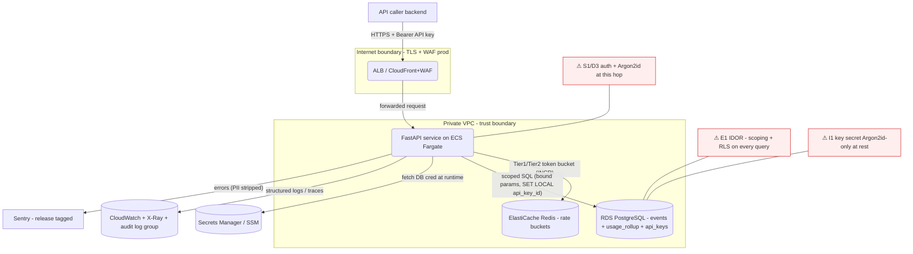

# Implementation Plan — Meterly: metered-event ingestion + usage query (first feature)

## Summary
Build two authenticated JSON endpoints and their storage for a high-throughput usage-metering
primitive. `POST /v1/events` appends an immutable event and increments the current hour's
per-(tenant, customer, metric) counter; it is **idempotent on a client-supplied
`idempotency_key`**, so a retried/duplicated request is a no-op that returns the original result.
`GET /v1/usage` returns the aggregated counter for a `(customer, metric, hour-window)`. Storage is
an append-only `events` table plus a derived `usage_rollup` hourly-aggregate table added by a
**second Alembic migration that backfills from `events`** (expand + backfill). Auth is
**API keys, Argon2id-hashed at rest**, with **per-key rate limiting**. The core approach —
**enforce idempotency and the counter increment inside one PostgreSQL transaction using a UNIQUE
constraint + `INSERT … ON CONFLICT`** — is chosen because it is the only mechanism that stays
correct under the concurrency the spec demands (50 simultaneous same-key POSTs → exactly one row)
*and* under horizontal scale-out across many Fargate tasks, where any application-level
check-then-insert or in-memory dedup would race. The whole thing runs as a Docker container on
ECS Fargate behind an ALB, with RDS PostgreSQL, an ElastiCache Redis rate-limit store, and
CloudWatch/X-Ray/Sentry observability, provisioned by Terraform under `infra/`.

---

## Stack notes (validating the defaults for this project)

The stack is largely fixed by `PROJECT.md`/`CLAUDE.md`; I assessed each choice rather than
rubber-stamping it, and flag two additions the human checkpoint should confirm.

- **Backend: Python 3.12 + FastAPI** — endorsed. FastAPI gives Pydantic v2 schema validation at
  the boundary (our primary Tampering mitigation) and a free OpenAPI document (DAST-1) for zero
  extra work. Async I/O matches an I/O-bound ingest path (network + DB waits dominate CPU), which
  is what lets a small task count sustain 500 req/s. Alternative considered: a sync
  Flask/WSGI stack — rejected because sustaining 500 req/s would need many more worker processes
  (one blocked thread per in-flight DB call), inflating cost and connection count.
- **Data store: PostgreSQL (RDS) + Alembic** — endorsed. This is a relational, transactional,
  strongly-consistent workload (idempotency + counter increment must be atomic; DDIA §"Storage
  model → relational default"). A key-value store (DynamoDB) was considered for the events append
  and rejected: the idempotency guarantee wants a real UNIQUE constraint + a multi-row transaction
  (event insert *and* rollup upsert together), which Postgres gives natively and DynamoDB only
  approximates with conditional writes + TransactWriteItems at more complexity and weaker joins for
  the backfill aggregate.
- **Packaging: Docker on ECS Fargate** — endorsed (`containerization-conventions` rubric): the
  target platform is container-native (Fargate), strict dev/CI/prod parity matters for a
  data-integrity service, and we want horizontal scale-out of the ingest process. **Managed runtime
  = ECS Fargate, not Kubernetes** — there is one service and no platform team; k8s' cluster
  overhead earns nothing here. Serverless (Lambda) was considered and rejected: a sustained 500
  req/s always-on ingest path with a warm connection pool fits a long-running container far better
  than per-invocation cold-start + connection-storm management. The existing
  `build-provenance.yml`/`deploy.yml` chain already assumes a Dockerfile + ECS, so this is the
  path of least resistance too.
- **Dependency manager: Poetry (`poetry.lock`)** — **new decision, please confirm.** `CLAUDE.md`
  doesn't name a Python packaging tool. I chose Poetry because `scripts/ci/lockfile-check.sh`
  recognizes only `poetry.lock`/`Pipfile.lock` as the lockfile for a Python `pyproject.toml` — a
  new `pyproject.toml` with no such lockfile is a **hard BLOCK**, and `uv.lock` is *not* recognized
  (it would false-block). Poetry gives a hashed, fully-resolved lockfile for deterministic
  container builds (delivery reproducibility posture). `INSTALL_CMD` for `pipeline-ci.yml` becomes
  `poetry install --no-root --only main` (dev extras for the test job).
- **Rate-limit store: ElastiCache (Redis)** — **addition beyond the listed stack (ECS+RDS+ALB);
  please confirm.** `PROJECT.md` requires "per-key rate limiting" but lists no shared store.
  `api-edge-conventions` is explicit that an in-process limiter **silently fails open behind a load
  balancer** (each task counts independently), and `iac-conventions` mandates ≥2 tasks/multi-AZ —
  so an in-process limiter cannot satisfy the requirement. Redis is the convention default: atomic
  token-bucket via a small Lua script, one round-trip, and it keeps rate-limit writes **off the RDS
  hot path** (protecting the p95 budget). Alternative considered: a Postgres counter table
  (reuses RDS, no new service) — rejected because it adds contended writes to the same instance the
  ingest path depends on, directly threatening AC-PERF; and DynamoDB atomic counters (serverless,
  cheap) — a reasonable second choice, noted as the fallback if adding ElastiCache is undesirable.
- **Auth: bespoke API keys (no third-party IdP)** — endorsed; this is `CLAUDE.md`'s recorded choice
  and matches the B2B server-to-server model (callers are backends, not humans with browsers), so
  the default Firebase/OAuth facade doesn't apply. The `auth-patterns` facade *shape* (a single
  `require_api_key` guard dependency) is still followed.
- **Observability: CloudWatch + X-Ray + Sentry** — endorsed (matches `CLAUDE.md` and the AWS
  default); SLOs defined per AC-SLO drive the canary rollback alarms.

**Frontend: N/A.** `PROJECT.md` → "Design source: none (API only)." No UI, no design source, so the
frontend-design-source rules and the Swift/store skills do not apply. No frontend section follows.

---

## Backend — API layer and services

### Endpoints (all mounted on the app; edge behavior inherited from middleware, not re-declared)

**`POST /v1/events`** — record an event + increment the current-window counter, idempotent.
- Request body (Pydantic, `extra='forbid'`): `{customer_id, metric, quantity, idempotency_key}`.
  The server, **never the client**, sets `api_key_id` (from auth), `event_time = now()` (UTC), and
  `window_start` (that timestamp floored to the hour, UTC). This is deliberate mass-assignment
  protection (ASVS 15.3.3): the client cannot backdate an event or forge a tenant.
- Behavior (one transaction, in `src/services/events_service.py` → `src/repositories/events_repo.py`):
  1. `INSERT INTO events (…) VALUES (…) ON CONFLICT (api_key_id, idempotency_key) DO NOTHING
     RETURNING id, quantity, window_start`.
  2. **If a row was returned** (this request won the insert): upsert the counter —
     `INSERT INTO usage_rollup (api_key_id, customer_id, metric, window_start, total_quantity,
     event_count) VALUES (…, :quantity, 1) ON CONFLICT (api_key_id, customer_id, metric,
     window_start) DO UPDATE SET total_quantity = usage_rollup.total_quantity + EXCLUDED.total_quantity,
     event_count = usage_rollup.event_count + 1, updated_at = now()`. Return **201** with the new
     event's representation.
  3. **If no row was returned** (a duplicate `idempotency_key`): `SELECT` the existing event,
     **do not touch the rollup**, and return **200** with that original event's representation
     (`idempotent_replay: true`). This is why duplicates never double-count.
- *What/why/how of the idempotency mechanism:* **what** — a DB `UNIQUE (api_key_id,
  idempotency_key)` constraint plus `ON CONFLICT DO NOTHING` is the source of truth for "have I
  seen this key?"; **why** over the alternatives — (a) an application `SELECT`-then-`INSERT`
  check has a TOCTOU window that 50 concurrent same-key requests will hit, producing duplicate
  rows (ASVS 15.4 TOCTOU); (b) the header-based Redis idempotency cache from
  `api-edge-conventions` is a good pattern for generic replay, but here it would be a *second*
  source of truth racing the durable event row and could disagree with it after a Redis eviction —
  the spec explicitly ties idempotency to the events table, and the constraint is both durable and
  race-proof across tasks; **how** — the database evaluates the unique index atomically, so exactly
  one of N concurrent inserts succeeds and the rest get zero rows and fall through to the read
  branch. This is the AC-CONCURRENCY mechanism and it needs no application lock.
- *Note on the `idempotency_key` scope:* keyed per **`api_key_id`** (the authenticated principal),
  not global, so one tenant's keys can never collide with or probe another's. A replay with the
  same key but a *different* body still returns the original result (spec: "duplicate key is a
  no-op, returns the original result") — we do not 409 on body mismatch in v1 (Open Question Q3).

**`GET /v1/usage?customer_id=&metric=&window=`** — return the aggregated counter.
- Reads a single `usage_rollup` row scoped by the authenticated `api_key_id`
  (`src/services/usage_service.py` → `src/repositories/usage_repo.py`):
  `SELECT total_quantity, event_count FROM usage_rollup WHERE api_key_id = :auth_key AND
  customer_id = :customer_id AND metric = :metric AND window_start = :window_start`.
- `window` is an ISO-8601 **timezone-aware** timestamp; the service floors it to the hour (UTC) to
  get `window_start`. A missing bucket returns **200** with `total_quantity: 0, event_count: 0`
  (zero usage is a valid answer, not a 404 — and returning 404 would leak whether *any* tenant has
  data for that bucket).
- *What/why/how of reading the rollup instead of aggregating `events` live:* **what** — GET reads
  one pre-aggregated row by primary key; **why** — a live `SUM(quantity) … GROUP BY` over the
  append-only `events` table is O(rows in the hour) and gets slower as ingest grows, which would
  fail the GET p95 < 100 ms budget under load; **how** — the counter is maintained incrementally on
  every write, so the read is an indexed single-row lookup (O(1)). This is the classic
  materialized-rollup trade: we pay a small write-amplification (one extra upsert per event) to buy
  a bounded, cheap read. Response returns only `{customer_id, metric, window_start, total_quantity,
  event_count}` — the minimal field set (ASVS 15.3.1), never a raw ORM row.

**`GET /health`** (liveness — 200 whenever the process is up, no dependencies) and
**`GET /health/ready`** (readiness — checks a fast DB `SELECT 1` and migration head). Split per
`containerization-conventions`: the ALB target-group health check and the canary soak use
`/health/ready` (so traffic is gated on real dependency health and drained during shutdown), while
the local smoke check hits `/health` (which must pass with no DB — see `smoke.env`).

### App construction and middleware ordering (`src/main.py`, `src/api/middleware.py`)
Edge concerns are centralized middleware registered once (the edge-facade rule), ordered
outermost→innermost per `api-edge-conventions`:
1. Request-ID / trace (sets `requestId`, resolves `traceId` from the active OTel span or the AWS
   `X-Amzn-Trace-Id` header) — so everything below logs with a correlation id.
2. Security headers (set on every response, including errors) — see the table under Security.
3. CORS — explicit allowlist from config (this is a server-to-server API; the default allowlist is
   empty/none rather than `*`).
4. Body-size guard — reject `Content-Length` over 8 KiB with **413** (these payloads are tiny; an
   unbounded body is a cheap DoS vector).
5. Tier-1 edge throttle (pre-auth, **IP+route**-keyed, Redis) — shed floods before spending an
   Argon2id verify.
6. Auth guard `require_api_key` (`src/auth`).
7. Tier-2 per-key throttle (post-auth, **api_key_id**-keyed, Redis).
8. Handler, wrapped by the error-envelope boundary (`src/api/errors.py`).

Lifespan startup: fetch DB credentials via the secrets facade, open the async DB pool, init the
Redis client, init OTel + Sentry (release = commit SHA). Shutdown: on `SIGTERM`, stop accepting new
work, drain in-flight requests, then close the DB pool and Redis — the graceful-shutdown contract
that keeps the canary from dropping requests (`containerization-conventions` R2).

---

## Data / migrations

### Schema (PostgreSQL)

**`api_keys`** (created in migration 0001):
| column | type | notes |
|---|---|---|
| `id` | `bigint GENERATED ALWAYS AS IDENTITY PRIMARY KEY` | internal surrogate; the tenant scope |
| `key_id` | `text NOT NULL UNIQUE` | public half of the split token (indexed lookup handle) |
| `secret_hash` | `text NOT NULL` | **Argon2id** hash of the secret half (credential) |
| `label` | `text NOT NULL` | human label, non-sensitive |
| `rate_limit_per_sec` | `integer NOT NULL DEFAULT 100` | per-key Tier-2 budget |
| `created_at` | `timestamptz NOT NULL DEFAULT now()` | |
| `revoked_at` | `timestamptz NULL` | non-null ⇒ key rejected |

**`events`** (created in migration 0001; append-only):
| column | type | notes |
|---|---|---|
| `id` | `bigint GENERATED ALWAYS AS IDENTITY PRIMARY KEY` | monotonic; good index locality for append |
| `api_key_id` | `bigint NOT NULL REFERENCES api_keys(id)` | tenant scope + RLS predicate |
| `customer_id` | `text NOT NULL` | metered customer (pseudonymous) |
| `metric` | `text NOT NULL` | metric name |
| `quantity` | `numeric(20,6) NOT NULL CHECK (quantity > 0)` | exact decimal, never float |
| `idempotency_key` | `text NOT NULL` | client dedup token |
| `event_time` | `timestamptz NOT NULL DEFAULT now()` | server receive time (UTC) |
| `window_start` | `timestamptz NOT NULL` | `event_time` floored to the hour (UTC), set by the service |
| `created_at` | `timestamptz NOT NULL DEFAULT now()` | |
- Constraints/indexes: `UNIQUE (api_key_id, idempotency_key)` (the idempotency guarantee);
  index `(api_key_id, customer_id, metric, window_start)` (drives the migration-0002 backfill
  `GROUP BY` and any operational query).
- *Why `window_start` is a plain column the service computes, not a `GENERATED … STORED` column:*
  `date_trunc('hour', <timestamptz>)` is **STABLE, not IMMUTABLE** (its result depends on the
  session `TimeZone`), so PostgreSQL rejects it in a stored generated column. Computing the hour
  floor in the service in explicit UTC (`ts.replace(minute=0, second=0, microsecond=0)`) sidesteps
  the timezone trap and is directly unit-testable.

**`usage_rollup`** (created + backfilled in migration 0002; derived hourly aggregate):
| column | type | notes |
|---|---|---|
| `api_key_id` | `bigint NOT NULL REFERENCES api_keys(id)` | tenant scope |
| `customer_id` | `text NOT NULL` | |
| `metric` | `text NOT NULL` | |
| `window_start` | `timestamptz NOT NULL` | hour bucket |
| `total_quantity` | `numeric(38,6) NOT NULL` | summed usage (wider precision — it accumulates) |
| `event_count` | `bigint NOT NULL` | events folded into this bucket |
| `updated_at` | `timestamptz NOT NULL DEFAULT now()` | |
- Primary key `(api_key_id, customer_id, metric, window_start)` — the natural one-row-per-bucket
  key and the `ON CONFLICT` target for the increment.

### Storage-model reasoning (DDIA)
- **Model:** relational, single-leader (RDS primary with a **multi-AZ synchronous standby** for HA,
  not read scaling). Single-leader is the default and correct: writes must be linearizable for the
  idempotency + counter guarantees; a leaderless/multi-leader store would introduce write
  conflicts on the counter that we'd have to resolve by hand. Read replicas to offload GET are a
  **future** option (noted, not built) — the rollup already makes GET cheap.
- **Partitioning:** none needed at this scale; a single primary sustains 500 req/s of short
  transactions. The natural future partition key is `api_key_id` (hash) if a single primary is
  outgrown — recorded for later, not built.
- **Consistency the read path needs:** read-your-writes for the counter — satisfied because the
  increment and the read both go to the single leader.
- **Hot-bucket contention (operability flag):** when many events target the *same* `(api_key_id,
  customer_id, metric, hour)`, they contend on one `usage_rollup` row's update lock. Realistic
  traffic spreads across many buckets so per-row contention is low; the **perf load scenario is
  therefore specified as a distributed key space** (many customer/metric combos), not a single-row
  hammer, which is representative rather than pathological. The documented escalation path if a
  concentrated bucket ever breaches p95 is a **sharded counter** (N sub-rows per bucket, summed on
  read) — a well-understood DDIA pattern. Not built now; called out as the known scaling limit.
- **Operability checklist:** proven (Postgres) ✓; observable (RED metrics + RDS metrics, §Observability) ✓;
  recoverable (automated snapshots + pre-migrate snapshot + the PR-P DR drill) ✓; access-controlled
  (app-layer `api_key_id` scoping + RLS, below) ✓.

### Row-level security (defense-in-depth; flagged for the checkpoint per DDIA)
`events` and `usage_rollup` hold per-tenant data, so RLS is required, not optional (DDIA). Two
layers:
1. **Primary control — application scoping.** Every repository query filters by the authenticated
   `api_key_id` *first*; no repo ever issues an unscoped `SELECT … FROM events`. This is the
   `code-standards` row-level-security invariant and the direct IDOR/BOLA (ASVS 8.2.2) mitigation.
2. **Backstop — PostgreSQL RLS.** Enable RLS on both tables with a policy
   `USING (api_key_id = current_setting('app.current_api_key_id')::bigint)`; the DB session sets
   `SET LOCAL app.current_api_key_id = :id` at the start of each request's transaction
   (`src/db/session.py`). The app connects as a role **without `BYPASSRLS`**, so even a missing
   application filter cannot leak another tenant's rows. *Tradeoff:* one `SET LOCAL` per request
   (negligible at 500 req/s) and the discipline of running every query inside a transaction.
   Flagged for the human checkpoint as the DDIA skill requires.

### Migrations (Alembic)
- **0001 — create `api_keys` + `events`** (a *create-migration*). `down` drops both in FK-safe
  order. Reversibility kind = **schema + constraints** (initial creation): row survival across
  `down` is undefined by definition (down drops the tables); AC-MIGRATION-1 asserts `up→down→up`
  restores the schema and re-enforces every CHECK/FK/UNIQUE/NOT NULL identically.
- **0002 — create `usage_rollup` + backfill from `events`** (an *expand + backfill*). `up`:
  `CREATE TABLE usage_rollup …` then
  `INSERT INTO usage_rollup (api_key_id, customer_id, metric, window_start, total_quantity,
  event_count, updated_at) SELECT api_key_id, customer_id, metric, window_start, SUM(quantity),
  COUNT(*), now() FROM events GROUP BY 1,2,3,4`. `down`: `DROP TABLE usage_rollup` (leaves `events`
  untouched). *Reversibility kind for AC-MIGRATION:* the **seeded `events` rows are preserved**
  across `up→down→up` (0002 never mutates `events`), and `usage_rollup` is **deterministically
  re-derived** from them each `up` — so `down` "losing" the rollup is expected (it is pure
  derivation, re-buildable), while the source rows survive. The backfill is idempotent because it
  rebuilds a freshly-created empty table.
- *Expand/contract note (why this is safe on a live system, and the greenfield simplification):*
  the classic zero-downtime order is deploy-dual-writing-code → backfill → switch-reads, so events
  written *during* the backfill aren't missed. This is the **first** deploy with no pre-existing
  traffic, and `deploy.yml`'s D2 sequence runs **snapshot → migrate → roll out** (migrations
  complete before the new dual-writing code serves traffic), so running 0001 then 0002 and then
  rolling out the final code is safe here. The pattern is honored so future rollups follow it.

---

## Auth — API keys, Argon2id at rest, per-key rate limiting

### Key format and verification (`src/auth`, `src/crypto`, `src/repositories/api_keys_repo.py`)
- **Split-token format:** `mtr_live_<key_id>_<secret>`, where `key_id` is a public random handle
  (stored plaintext, `UNIQUE`-indexed) and `secret` is a ≥128-bit CSPRNG value. Only `secret`'s
  **Argon2id** hash is stored (`argon2-cffi`, via the `crypto` DataProtection facade). *Why split
  the token:* it lets us find the row by an indexed `key_id` lookup (O(1)) and then verify only the
  secret — we never have to hash-scan the table to identify a key. This is the GitHub/Stripe PAT
  pattern.
- **Verification flow:** parse `key_id` + `secret` (reject any malformed token → 401 before any DB
  work) → `SELECT … WHERE key_id = :key_id AND revoked_at IS NULL` → `Argon2id.verify(secret,
  row.secret_hash)`. On success the request principal is `row.id` (`api_key_id`).
- **The Argon2id-vs-p95 tension and its resolution — a load-bearing decision.** Argon2id is
  *intentionally slow* (tens of ms). Running it on **every** request at 500 req/s would blow the
  50 ms p95 budget by itself and burn CPU. Resolution: an **in-process verification cache**
  (`src/auth`, TTL ~5 min) keyed by `SHA-256(presented_key)` → `{api_key_id, rate_limit,
  verified_at}`. On a cache **hit**, we constant-time-compare the presented key's SHA-256 to the
  cached digest and skip Argon2id entirely; on a **miss**, we run the split-token lookup + Argon2id
  verify once and populate the cache.
  - *Why this is correct and safe:* the durable at-rest store stays **Argon2id** (AC-DATA-PROTECTION
    is about *storage*, and storage is unchanged); the cache holds only a SHA-256 of a
    high-entropy key (irreversible) and never plaintext. Argon2id's slow-KDF value is brute-force
    resistance on *guessable* secrets — an API key is a 128-bit random value with nothing to guess,
    so a fast in-memory comparison after the first slow verify loses no meaningful security.
  - *Tradeoff:* a revoked key stays usable on a task that cached it for up to the TTL (~5 min).
    Accepted for v1 and documented; a shared-cache invalidation channel is a future option (Open
    Question Q4). The cache is in-process (per task) **by design** — a shared Redis lookup on every
    request would re-add the latency we're removing.

### Per-key rate limiting (`src/auth/rate_limit.py`, Redis)
- **Tier 2 (post-auth, keyed on `api_key_id`)** — the real per-owner throttle, a token bucket in
  Redis via an atomic Lua script (single round-trip). Limit = the key's `rate_limit_per_sec`.
  Registered on a dependency that runs **after** `require_api_key`, so the authenticated principal
  exists at key-generation time. Verified by the mandatory **two-principals-one-IP** test: two keys
  behind one client IP get independent buckets; one key across two IPs shares a bucket.
- **Tier 1 (pre-auth, keyed on IP+route)** — a coarser Redis token bucket to shed unauthenticated
  floods before we spend an Argon2id verify (also protects against the Argon2id-CPU DoS).
- **Response:** `429` with a `Retry-After` header (never a bare drop, so clients back off
  deterministically). Emit a `warn` log as a bucket nears empty and on every `429` (attack signal,
  `logging-conventions`).
- **State in Redis, never in-process** — an in-process counter is per-task and fails open behind
  the ALB (`api-edge-conventions`); this is the reason ElastiCache is in the stack.

### Key provisioning (no key-creation endpoint is in scope)
A `scripts/seed_api_key.py` CLI generates a key, prints the plaintext **once**, and stores only its
Argon2id hash (the key never lands in a migration — `code-standards` forbids credentials in
migration files). This same script seeds the low-privilege **DAST test key** (DAST-2) in
staging/local; its output secret is written to SSM / read from env, never hardcoded.

---

## Observability (logging + operational)

### Structured logging (`src/logging`, structlog → CloudWatch)
- One configured logger (`get_logger()` facade); JSON to stdout (ECS ships it to CloudWatch with no
  app change). Standard fields + request-scoped `requestId`/`traceId`/`operation`, plus
  `duration`/`statusCode` on completion and `error.type/message/stack` (stack **server-side only**)
  on errors.
- **Audit events (5W+H):** `apikey.auth` (success/failure, with the *opaque* `api_key_id` as
  `userId` — never the key), `event.create` (CRUD; `resource_id` = event id), `usage.read`,
  `ratelimit.exceeded` (the 429 attack signal), input **and** output validation failures (`warn`),
  and migration runs (admin). `api_key_id` is an internal surrogate integer, safe as an opaque id;
  the **key secret, and `customer_id`, are never logged raw** (customer_id is redacted/hashed per
  the PII rule).
- **Immutability:** a **separate audit CloudWatch log group** with a resource policy denying
  `logs:Delete*`/`PutRetentionPolicy` to all but a dedicated ops role; 90-day hot retention +
  nightly S3 (Object Lock) archive. Declared in `infra/` — the app role holds no log-delete or
  `s3:DeleteObject` on the archive.

### Operational surfaces (`src/observability`, `infra/`)
- **Sentry**, release-tagged to the deploy **commit SHA** (the same SHA `build-provenance` signs and
  `deploy.yml` rolls out), `environment = staging|prod`; a `before_send` hook strips the API key,
  `Authorization` header, and `customer_id` at the SDK boundary.
- **OTel → ADOT collector sidecar → X-Ray (traces) + CloudWatch (metrics)**; emit RED metrics
  (Rate/Errors/Duration) per route as the raw material for the SLOs.
- **SLOs (AC-SLO):** (a) **availability 99.9%**, (b) **ingest `POST /v1/events` p95 < 50 ms**.
  Multi-window burn-rate alarms (fast-burn 1h page, slow-burn 6h ticket) on each, plus the
  `iac-conventions` minimum three canary alarms — **5xx rate, ALB p95 target latency, unhealthy-host
  count**. Named so `deploy.yml`'s `<PROD_ALARM_NAMES>` can reference them:
  `meterly-prod-5xx-rate`, `meterly-prod-alb-p95-latency`, `meterly-prod-unhealthy-hosts`,
  `meterly-prod-slo-availability-fastburn`, `meterly-prod-slo-ingest-p95-fastburn`. These alarms are
  a **delivery dependency** — the canary soak rolls back on any of them firing.
- **Synthetic canary:** a CloudWatch Synthetics probe of both endpoints from outside the VPC, using
  a dedicated **synthetic test tenant** (so probe writes don't pollute a real customer's counters).
- Mobile crash reporting: N/A (API only).

---

## Infrastructure (Terraform under `infra/`, AWS)

Root module composes child modules; `envs/staging` + `envs/prod` are thin instantiations of the
same modules (shape-parity, reduced scale in staging) with **separate state keys** in one S3 bucket
+ one DynamoDB lock table (`iac-conventions`). Remote state SSE-encrypted; `*.tfstate` and
secret-bearing `*.tfvars` gitignored.

- **network:** VPC, public subnets (ALB) + private subnets (Fargate tasks, RDS, Redis) across ≥2
  AZs; security groups least-privilege (ALB:443 from internet; tasks:8000 from ALB only;
  RDS:5432 and Redis:6379 from the task SG only — never `0.0.0.0/0`).
- **compute:** ECS Fargate service (**≥2 tasks, multi-AZ, target-tracking autoscaling**), ALB with
  **blue/green target groups** + a listener rule (the weighted-canary primitive `deploy.yml` shifts),
  health check → `/health/ready`. ECR repo with **immutable tags**.
- **data:** RDS PostgreSQL — **`storage_encrypted = true` (KMS CMK)**, **multi-AZ**,
  **`publicly_accessible = false`**, **deletion protection**, automated backups (Checkov-enforced
  baseline). ElastiCache Redis (encryption in transit + at rest) for rate-limit buckets.
- **secrets:** AWS Secrets Manager (RDS credentials, managed rotation) + SSM Parameter Store
  (SecureString: `DATABASE_URL`, config). The app fetches these at runtime through the secrets
  facade; **nothing in env files, image layers, or tfvars** (`secrets-management`).
- **observability infra:** CloudWatch log groups (app + audit, retention + deny-delete policy),
  X-Ray write permission, the SLO/canary alarms + SNS, S3 Object-Lock archive bucket, CloudWatch
  Synthetics canary.
- **edge (prod only):** CloudFront → AWS WAF (managed core + known-bad-inputs); staging skips it
  (cost) — the app-level rate limiting still applies there.
- **identity:** GitHub OIDC deploy role (short-lived, least-privilege) and an ECS **task role**
  scoped to exactly: read the one Secrets Manager secret + the SSM params, `kms:Decrypt` on the one
  CMK, write CloudWatch logs (no delete), write X-Ray, and network reach to Redis — no wildcards.
- **cost guardrails:** AWS Budgets per env with an 80%/forecast alert → SNS; the required
  `environment`/`service` tags activated as cost-allocation tags.

RDS/Redis sizing is **not asserted** here — it is validated by the PR-N/P load campaign against
the AC-PERF budget; the plan documents the budget, the campaign buys the scale truth.

---

## Containerization (`Dockerfile`, `.dockerignore`)
Multi-stage build; runtime base **`python:3.12-slim` pinned by digest**; run as a **non-root**
user; **no secrets in layers or build args** (injected at runtime); `.dockerignore` to keep context
small; **deterministic install from `poetry.lock`** (`poetry install --only main --no-root`). Handle
`SIGTERM` for graceful drain (readiness flips false, in-flight requests finish, pool closes) within
the ECS `stopTimeout`. `hadolint` (pre-build) and `dockle` (built image: non-root, no secrets in
layers) already run in `build-provenance.yml`; the Dockerfile is authored to pass them.

---

## Security — validation contracts and controls summary

**Validation contract per boundary input** (schema-first, in the named file; the sink each protects):

| Input (source) | Type + bound + allowlist | Sink it protects | Schema/file |
|---|---|---|---|
| `customer_id` (POST body, GET query) | `str`, `constr(pattern=r'^[A-Za-z0-9_.:-]{1,128}$')` | events/rollup SQL insert + PK lookup (parameterized) | `src/api/schemas/events.py`, `src/api/schemas/usage.py` |
| `metric` (POST body, GET query) | `str`, `constr(pattern=r'^[A-Za-z0-9_.:-]{1,64}$')` | events/rollup SQL | same |
| `quantity` (POST body) | `condecimal(gt=0, le=Decimal('1e12'), max_digits=20, decimal_places=6)` | `numeric` column + counter arithmetic (overflow/abuse) | `src/api/schemas/events.py` |
| `idempotency_key` (POST body) | `str`, `constr(pattern=r'^[A-Za-z0-9_-]{1,200}$')` | UNIQUE-index lookup (index-bloat/abuse) | `src/api/schemas/events.py` |
| `window` (GET query) | `AwareDatetime`, range `[now-90d, now+1h]`, floored to hour UTC; naive datetimes rejected | SQL `window_start` equality (parameterized) | `src/api/schemas/usage.py` |
| `Authorization` API key (header) | `str`, strict `^mtr_live_[A-Za-z0-9]{1,32}_[A-Za-z0-9]{1,64}$` parse | key lookup + Argon2id verify | `src/auth/api_key.py` |

- All request bodies use `model_config = ConfigDict(extra='forbid')` (rejects unknown fields →
  mass-assignment protection, ASVS 15.3.3). Regexes are anchored (`^…$`), bounded, and ReDoS-safe
  (no nested/ambiguous quantifiers). Malformed/oversized/wrong-type → **422** (FastAPI/Pydantic);
  oversized body → **413**.
- **Output at the SQL sink** is always via SQLAlchemy bound parameters (never string interpolation)
  — parameterized queries are the SQLi defense (ASVS 1.2.4) that pairs with the input allowlist.

**Security headers** (middleware, on every response including errors): `Strict-Transport-Security:
max-age=63072000; includeSubDomains`; `X-Content-Type-Options: nosniff`; `Content-Security-Policy:
default-src 'none'`; `X-Frame-Options: DENY`; `Referrer-Policy: strict-origin-when-cross-origin`;
`Cache-Control: no-store` on `/v1/usage` responses (ASVS 14.3.2). Swagger UI (`/docs`) is disabled
in prod (ASVS 13.4.5); `/openapi.json` is served (DAST-1).

### Data classification → at-rest control (`data-protection-conventions`)
| Field | Class | At-rest control | Verified by |
|---|---|---|---|
| `api_keys.secret_hash` | **credential** | **Argon2id** slow KDF (crypto facade) — plaintext never stored | persisted-form test (AC-DATA-PROTECTION) |
| `events.customer_id`, `usage_rollup.customer_id` | **personal (pseudonymous)** | **RDS SSE** (KMS CMK) + TLS in transit + opaque/redacted in logs & Sentry | Checkov `storage_encrypted=true` + log-sink check |
| `api_keys.key_id`, `label` | non-sensitive (public handle / label) | none | — |
| `events.metric`, `quantity`, `idempotency_key`, all timestamps; `usage_rollup` totals | non-sensitive | none (covered by SSE regardless) | — |

*Classification reasoning:* `customer_id` is a caller-chosen pseudonymous identifier with no
inherent linkage to a natural person on Meterly's side, but under the worst-case interpretation it
could carry a person's name, so it is conservatively classed **personal** and protected by RDS SSE
(which we run anyway) rather than field-level KMS encryption — field-level encryption would break
the equality lookups (`WHERE customer_id = …`, PK) that GET and the rollup PK depend on, and
deterministic encryption to preserve those lookups would be over-engineering for a pseudonymous id.
The **RDS credential** the app consumes at runtime is not a stored user field — it lives in Secrets
Manager and is fetched through the secrets facade (Info-Disclosure threat I1).

---

## New third-party dependencies (exact pins — subject to plan-audit's registry + cooldown check)

Managed by Poetry; `poetry.lock` committed (hashed, fully resolved). Pins are the intended targets;
`plan-audit`'s `dependency-audit-policy` (registry existence, 14-day cooldown, exact-pin
determinism) and implementation resolve the exact compatible set within policy.

| Package | Version | Why |
|---|---|---|
| `fastapi` | `0.115.6` | API framework + Pydantic v2 validation + OpenAPI (DAST-1) |
| `uvicorn[standard]` | `0.34.0` | ASGI server |
| `gunicorn` | `23.0.0` | process manager (uvicorn workers) in the container |
| `pydantic` | `2.10.4` | boundary schemas / validation contracts |
| `pydantic-settings` | `2.7.1` | config facade (bootstrap env only) |
| `sqlalchemy` | `2.0.36` | async ORM/core; bound-parameter queries |
| `asyncpg` | `0.30.0` | async Postgres driver (throughput) |
| `alembic` | `1.14.0` | migrations |
| `argon2-cffi` | `23.1.0` | Argon2id hashing/verify (crypto facade) |
| `redis` | `5.2.1` | async Redis client (rate-limit token buckets) |
| `structlog` | `24.4.0` | structured logging facade |
| `sentry-sdk` | `2.19.2` | error tracking (release-tagged) |
| `opentelemetry-sdk` | `1.29.0` | traces/metrics |
| `opentelemetry-instrumentation-fastapi` | `0.50b0` | FastAPI OTel instrumentation |
| `opentelemetry-exporter-otlp` | `1.29.0` | export to the ADOT collector |
| `boto3` | `1.35.90` | Secrets Manager / SSM access (secrets facade) |
| **dev** `pytest` | `8.3.4` | test runner |
| **dev** `pytest-asyncio` | `0.25.0` | async tests |
| **dev** `pytest-cov` | `6.0.0` | coverage (`--cov=src --cov-branch`) |
| **dev** `httpx` | `0.28.1` | async test client |
| **dev** `testcontainers[postgres]` | `4.9.0` | real Postgres for integration/concurrency/migration tests |
| **dev** `hypothesis` | `6.123.2` | property-based tests for the validation contracts |

Load testing uses **k6** (a binary, not a pip dep) per the `load-campaign.yml` convention. ADOT
collector is an ECS sidecar image, not a Python dep.

---

## Files affected (create)

- `pyproject.toml`, `poetry.lock` — deps + deterministic lock (satisfies `lockfile-check.sh`).
- `Dockerfile`, `.dockerignore` — container (build-provenance/deploy path).
- `src/main.py` — app construction, middleware registration, router mount, lifespan.
- `src/config/settings.py` — config facade (bootstrap env, not secret values).
- `src/config/secrets.py` — secrets facade (Secrets Manager / SSM via boto3).
- `src/api/routes/events.py` — `POST /v1/events`.
- `src/api/routes/usage.py` — `GET /v1/usage`.
- `src/api/routes/health.py` — `/health` (liveness) + `/health/ready` (readiness).
- `src/api/schemas/events.py`, `src/api/schemas/usage.py` — Pydantic validation contracts.
- `src/api/middleware.py` — request-id/trace, security headers, CORS, body-size, edge throttle.
- `src/api/errors.py` — error-envelope facade (exception → `{error:{code,message,requestId}}`).
- `src/auth/__init__.py` — `require_api_key` guard + in-process verification cache.
- `src/auth/api_key.py` — split-token parse + Argon2id verify.
- `src/auth/rate_limit.py` — Tier-1 (IP) + Tier-2 (per-key) Redis token buckets.
- `src/crypto/__init__.py` — DataProtection facade (Argon2id hash/verify, constant-time compare).
- `src/services/events_service.py` — idempotent insert + rollup increment (one txn).
- `src/services/usage_service.py` — scoped usage read + hour flooring.
- `src/repositories/events_repo.py`, `usage_repo.py`, `api_keys_repo.py` — SQL (bound params, `ON CONFLICT`).
- `src/db/session.py` — async engine/pool + `SET LOCAL app.current_api_key_id` per request.
- `src/logging/__init__.py` — `get_logger()` structlog facade + redaction.
- `src/logging/middleware.py` — request logging (requestId/traceId/duration/statusCode).
- `src/observability/otel.py`, `src/observability/sentry.py` — OTel/ADOT + Sentry (release-tagged).
- `alembic.ini`, `alembic/env.py`, `alembic/versions/0001_create_api_keys_and_events.py`,
  `alembic/versions/0002_create_usage_rollup_backfill.py` — migrations.
- `scripts/seed_api_key.py` — key/DAST-test-key provisioning (prints plaintext once, stores hash).
- `infra/` — `main.tf`, `variables.tf`, `outputs.tf`, `backend.tf`, `modules/{network,compute,data,observability,edge}`, `envs/{staging,prod}/main.tf`.
- `tests/` — see Test strategy.
- `docs/` — README/system-architecture updates for touched dirs (per "done" definition).
- `.pipeline/acceptance.md` — emitted below.

---

## Test strategy

**Shape: `pyramid`** (default). This feature has substantial local logic (validation contracts,
hour flooring, split-token parse, Argon2id facade, token-bucket math, error mapping) that is
cheaply unit-tested, over a thinner integration tier. It is **not** integration-heavy — but several
correctness guarantees are only real against **actual PostgreSQL**, so those are integration tests
by necessity (`testcontainers[postgres]`): the `ON CONFLICT` concurrency guarantee, the migration
round-trips, the rollup upsert arithmetic, RLS/tenant isolation, and the auth path. Adversarial
shapes required by `test-conventions` and generated proactively:
- **Concurrency/idempotency** — 50 concurrent same-key POSTs → assert exactly one `events` row,
  the losers get the idempotent **replay** (original result, 200), and `usage_rollup.event_count`
  incremented **once** (AC-CONCURRENCY).
- **Rate limit** — the **two-principals-one-IP** shape: key A exhausts its Tier-2 bucket (429)
  while key B on the same IP still succeeds; one key across two IPs shares a bucket.
- **Every DB constraint** (CHECK `quantity>0`, FK `api_key_id`, UNIQUE, NOT NULLs) → drive a
  violation → assert a mapped **4xx envelope, never a 500**.
- **Injection at the SQL sink** — `' OR 1=1--`, `../../`, CRLF in `customer_id`/`metric`/
  `idempotency_key` → rejected by the anchored allowlist at the boundary (and parameterized at the
  sink).
- **IDOR/BOLA** — key B queries a `customer_id` key A wrote → gets B's own zero, never A's data;
  same for the write path (an event is only ever attributed to the caller's own `api_key_id`).
- **Unauthenticated denial** — missing/invalid/revoked key → 401/403, never 200.
- **Safe-error** — force an internal error → generic envelope, **no** stack/SQL/secret/key, correct
  status, and **fail-closed** (no partial write: the event + rollup are one transaction).
- **data_protection persisted-form** — read the raw `api_keys.secret_hash` column: it is an
  Argon2id hash, `verify(secret)` succeeds, the plaintext never appears (AC-DATA-PROTECTION).
- **Migration round-trips** — 0001 schema+constraint reversibility; 0002 seeded-`events`
  preservation + rollup re-derivation, on a **prod-shaped seeded dataset** (AC-MIGRATION).
- **Property-based** (Hypothesis) over each validation contract.
- **Load/perf (k6)** — see AC-PERF: `constant-arrival-rate` at 500 req/s over a **distributed key
  space** for a sustained window; record true p95 by nearest-rank over captured latencies (not a
  tool's named bucket), throughput, and `perf.scenario`.

Coverage: `pytest --cov=src --cov-branch`, target **≥85% lines** (`CLAUDE.md`) — surfaced, with the
hard testing gates being acceptance-criteria completeness and perf-pairing.

---

## Open questions (planning's proposed answers, to confirm at the checkpoint)

- **Q1 — ElastiCache Redis addition.** The listed stack is ECS+RDS+ALB, but "per-key rate limiting"
  requires a shared store (in-process fails open behind the ALB). *Proposed:* add ElastiCache
  Redis; fallback is DynamoDB atomic counters if a new managed service is unwanted.
- **Q2 — PostgreSQL RLS as defense-in-depth.** *Proposed:* enable it (per DDIA), accepting one
  `SET LOCAL` per request and the run-every-query-in-a-transaction discipline; app role has no
  `BYPASSRLS`. Flagged because DDIA requires the RLS decision be surfaced.
- **Q3 — Idempotency-key body mismatch.** A replay with the same key but a different body.
  *Proposed:* return the original result (matches the spec's "no-op returns the original result");
  do not 409. Revisit if callers want a conflict signal.
- **Q4 — Key-revocation latency.** The in-process verification cache means a revoked key works for
  up to ~5 min on a task that cached it. *Proposed:* accept for v1 (documented); add a shared
  invalidation channel later if faster revocation is needed.
- **Q5 — `account_id` vs `api_key_id` as the tenant scope.** v1 scopes tenancy by `api_key_id`
  directly (simplest correct isolation), which means rotating a key would orphan its prior usage.
  *Proposed:* accept for this build (key rotation isn't in scope); introduce an `account_id` the key
  belongs to when key management ships. Recorded as an accepted risk, not built.

---

## Acceptance-criteria trace (against `PROJECT.md` "done" + non-functional signals)

Every criterion is traced to a plan section and emitted, testable, into `.pipeline/acceptance.md`.

| PROJECT signal | Plan section | acceptance.md |
|---|---|---|
| Both endpoints return correct output | Backend | AC1, AC2, AC5 |
| Idempotency (no-op returns original) | Backend / Data | AC3, AC4 |
| AC-PERF (ingest p95<50ms @500rps, ≥475rps; usage p95<100ms) | Data (rollup) / Observability | AC6 |
| AC-CONCURRENCY (50 same-key → 1 row) | Backend / Data (ON CONFLICT) | AC7 |
| AC-DATA-PROTECTION (Argon2id, never plaintext) | Auth / Data classification | AC8 |
| AC-MIGRATION (0002 up→down→up preserves seeded rows) | Migrations | AC9 |
| AC-SLO (99.9% avail, ingest p95<50ms) | Observability | AC10 |
| Input validation; malformed → 4xx | Security / Validation contracts | AC11a/b, AC12a/b |
| Per-key rate limiting | Auth / rate limiting | AC13, AC14 |
| Tenant isolation (IDOR) | Data / RLS | AC15 |
| Auth required | Auth | AC16 |
| Safe errors (no leak) | Security / error envelope | AC17 |
| ASVS L1/L2 met | ASVS Compliance | AC18 |
| Smoke `/health` 200 | Backend / health split | AC19 |
| DAST readiness (schema, test user, auth context) | Security / seeding | AC20, AC21, AC22 |

---

## Threat Model

### Assets and trust boundaries
**Assets:** API-key secrets (and their Argon2id hashes); per-tenant `events` + `usage_rollup` data
(billing-grade — usage feeds invoicing later); the two endpoints; the RDS credential; the Redis
rate-limit state; the ECS/RDS/Redis/IAM cloud resources; the CloudWatch audit trail.
**Trust boundaries:** client↔ALB/API (internet); API↔RDS; API↔Redis; API↔Secrets Manager/SSM;
API↔CloudWatch/X-Ray; app↔AWS control plane (IAM/task role); CI↔AWS (GitHub OIDC).

| # | Category | Asset / Boundary | Attack vector | Sev | Mitigation → concrete mechanism (file) | ASVS |
|---|---|---|---|---|---|---|
| S1 | Spoofing | client↔API | Unauthenticated or forged-key request | H | `require_api_key` guard rejects malformed/unknown/revoked → 401; split-token lookup + `argon2-cffi` `verify` (`src/auth/api_key.py`, `src/crypto/__init__.py`, `src/repositories/api_keys_repo.py`) | 6.2.8, 6.4.1 |
| S2 | Spoofing | CI↔AWS / registry | Deploy as a forged identity / push an unsigned image | M | GitHub OIDC role assumption (no static keys) + `cosign verify` identity-pinned before rollout (`infra/`, `deploy.yml`) | 13.2.1 |
| T1 | Tampering | client↔API | Injection/overflow via `customer_id`/`metric`/`idempotency_key`/`quantity` | H | Pydantic anchored-allowlist `constr` + bounds + `extra='forbid'`; SQLAlchemy bound params at the sink (`src/api/schemas/*`, `src/repositories/*`) | 1.2.4, 2.2.1, 2.2.2, 15.3.3 |
| T2 | Tampering | app↔datastore | Client backdates an event or forges its tenant | M | Server sets `event_time`/`window_start`/`api_key_id`; request schema allows only the 4 client fields (`src/services/events_service.py`, `src/api/schemas/events.py`) | 15.3.3, 8.2.3 |
| T3 | Tampering | in transit | MITM alters requests/responses | M | TLS 1.2/1.3 at the ALB; TLS to RDS + Redis (`infra/`) | 12.1.1, 12.3.1 |
| R1 | Repudiation | events data | Caller disputes a recorded event / usage total (billing dispute) | M | Append-only `events` (immutable source of truth) + 5W+H audit logs to an immutable CloudWatch group (deny-delete) + S3 Object-Lock archive (`src/logging`, `src/services/events_service.py`, `infra/`) | 16.2.1, 16.3.4, 16.4.2 |
| I1 | Info Disclosure | API-key secret / RDS cred | Secret stored plaintext, logged, or baked into the image | H | Argon2id at rest (`src/crypto`); key/`Authorization` never logged (`src/logging` redaction); RDS cred from Secrets Manager, not image/tfvars (`src/config/secrets.py`, `infra/`) | 11.4.2, 13.3.1, 16.2.5 |
| I2 | Info Disclosure | error responses | Verbose error leaks stack/SQL/internal path | M | Error-envelope facade → generic `{error:{code,message,requestId}}`, stack server-side only (`src/api/errors.py`) | 16.5.1, 16.5.3 |
| I3 | Info Disclosure | customer_id (personal) | PII exposed at rest / in logs / in Sentry | M | RDS SSE (KMS, Checkov); `customer_id` redacted/opaque in logs; Sentry `before_send` strip; `Cache-Control: no-store` on usage; API key kept in header, never URL (`infra/`, `src/logging`, `src/observability/sentry.py`, `src/api/middleware.py`) | 14.2.1, 14.3.2 |
| D1 | DoS | client↔API | Ingest flood / expensive query exhausts the service | H | Tier-1 IP + Tier-2 per-key Redis token buckets → 429+`Retry-After`; 8 KiB body cap → 413; GET is an O(1) PK lookup; bounded pool; prod CloudFront+WAF (`src/auth/rate_limit.py`, `src/api/middleware.py`, `infra/`) | 2.4.1, 15.2.2 |
| D2 | DoS | usage_rollup row | Hot-bucket lock contention on a single counter | M | Short single-row upsert txns; distributed-key-space perf scenario; documented sharded-counter escalation (`src/repositories/usage_repo.py`) | 15.4 |
| D3 | DoS | auth path | Argon2id CPU exhaustion by unauth flood | M | In-process verification cache (fast-hash after first verify) + Tier-1 edge throttle before the verify (`src/auth/__init__.py`, `src/auth/rate_limit.py`) | 2.4.1 |
| E1 | Elevation | events/rollup | Valid key reads/writes another tenant's data (IDOR/BOLA) | H | Mandatory `api_key_id` scoping predicate in every repo query (never unscoped) + PostgreSQL RLS `USING (api_key_id = current_setting(...))`, app role without `BYPASSRLS` (`src/repositories/*`, `src/db/session.py`, migration policy) | 8.2.1, 8.2.2, 8.4.1 |
| E2 | Elevation | cloud control plane | Over-permissioned task/deploy role | M | Least-privilege task role (one secret, `kms:Decrypt` one CMK, logs/xray write, no wildcards); scoped OIDC deploy role (`infra/`) | 13.2.2 |
| E3 | Elevation | events insert | Mass-assignment of internal fields (`api_key_id`, `event_time`) | M | `extra='forbid'` schema binds only the 4 allowed fields; server sets the rest (`src/api/schemas/events.py`) | 15.3.3 |

**Cloud attack surface (change includes `infra/`):** public RDS → `publicly_accessible=false` +
private subnet (Checkov); unencrypted at rest → RDS/Redis/S3/state SSE with KMS (Checkov);
secrets in state/tfvars → Secrets Manager/SSM only, `*.tfvars`/`*.tfstate` gitignored; over-broad
ingress → SGs scoped to the ALB/task SGs, never `0.0.0.0/0` on 5432/6379; audit/tamper → CloudTrail
+ deny-delete log policy + Object Lock. These fold into threats I1/I3/T3/E2 above.

### Accepted risks / out of scope
- Billing/invoice export, multi-tenant orgs & RBAC, dashboard/UI, extra metric types, webhooks —
  explicitly out of scope (`PROJECT.md`); no code for them.
- Key-revocation latency up to the ~5-min cache TTL (Q4) — accepted, documented.
- `api_key_id` (not `account_id`) as tenant scope, so key rotation orphans prior usage (Q5) —
  accepted for v1.
- Hot single-bucket counter contention beyond the distributed load profile — mitigation
  (sharded counter) designed but not built; the load campaign is the trigger to build it.

### Threat-model diagram (Mermaid DFD)


### Copy-paste visualization prompt
```text
Build a threat-model diagram for "Meterly", a usage-metering HTTP API.

ASSETS: API-key secrets and their Argon2id hashes; per-tenant events and usage_rollup data
(billing-grade); the endpoints POST /v1/events and GET /v1/usage; the RDS database credential;
the Redis rate-limit state; the ECS/RDS/Redis/IAM cloud resources; the CloudWatch audit trail.

TRUST BOUNDARIES: client<->ALB/API (internet); API<->RDS PostgreSQL; API<->ElastiCache Redis;
API<->AWS Secrets Manager/SSM; API<->CloudWatch/X-Ray; app<->AWS control plane (IAM task role);
CI<->AWS (GitHub OIDC).

STRIDE THREATS (threat; vector; severity; mitigation; concrete mechanism):
- S1 Spoofing; unauthenticated or forged-key request; HIGH; API-key auth guard rejects malformed/
  unknown/revoked -> 401; split-token lookup + argon2-cffi verify.
- S2 Spoofing; forged CI identity / unsigned image; MEDIUM; GitHub OIDC role + cosign verify
  identity-pinned before rollout.
- T1 Tampering; injection/overflow via customer_id/metric/idempotency_key/quantity; HIGH; Pydantic
  anchored-allowlist constr + bounds + extra=forbid; SQLAlchemy bound parameters.
- T2 Tampering; client backdates event or forges tenant; MEDIUM; server sets event_time/
  window_start/api_key_id; schema allows only 4 client fields.
- T3 Tampering; MITM; MEDIUM; TLS 1.2/1.3 at ALB and to RDS + Redis.
- R1 Repudiation; caller disputes recorded usage; MEDIUM; append-only events table + 5W+H audit
  logs to an immutable CloudWatch group + S3 Object Lock archive.
- I1 Info Disclosure; API-key/RDS secret plaintext/logged/in image; HIGH; Argon2id at rest;
  never log the key; RDS cred from Secrets Manager not image/tfvars.
- I2 Info Disclosure; verbose error leaks stack/SQL; MEDIUM; central error-envelope facade,
  generic message, stack server-side only.
- I3 Info Disclosure; customer_id PII at rest/logs/Sentry; MEDIUM; RDS SSE (KMS); redact
  customer_id in logs; Sentry before_send strip; Cache-Control no-store; key in header not URL.
- D1 DoS; ingest flood/expensive query; HIGH; Tier-1 IP + Tier-2 per-key Redis token buckets ->
  429+Retry-After; 8KiB body cap; O(1) rollup read; WAF (prod).
- D2 DoS; hot single-counter row contention; MEDIUM; short single-row upsert txns; distributed
  load profile; sharded-counter escalation.
- D3 DoS; Argon2id CPU exhaustion; MEDIUM; in-process verification cache after first verify +
  Tier-1 edge throttle before the verify.
- E1 Elevation; valid key reads/writes another tenant (IDOR/BOLA); HIGH; mandatory api_key_id
  scoping predicate on every query + PostgreSQL RLS; app role without BYPASSRLS.
- E2 Elevation; over-permissioned task/deploy role; MEDIUM; least-privilege task role (one secret,
  one CMK decrypt, logs/xray) + scoped OIDC deploy role.
- E3 Elevation; mass-assignment of internal fields; MEDIUM; extra=forbid schema; server sets the
  non-client fields.

Render this as an OWASP Threat Dragon diagram. Output either (a) valid Threat Dragon JSON importable
at app.threatdragon.com, or (b) a labeled data flow diagram with trust boundaries if JSON is not
feasible. No additional context is available beyond what is in this prompt.
```

---

## ASVS Compliance (OWASP ASVS 5.0.0 — L1+L2 universal, L3 project-specific)

**Triggered chapters:** V1 (encoding/SQLi), V2 (validation + anti-automation), V4 (HTTP API),
V6 (credential storage — API keys), V8 (authorization / IDOR), V11 (Argon2id + CSPRNG), V12 (TLS),
V13 (config/secrets), V14 (data protection), V15 (secure coding — mass-assignment, concurrency,
resource exhaustion, deps), V16 (logging + error handling).
**`n/a`:** V3 (no HTML/cookies — CORS covered by V4/headers), V5 (no file handling), V7 (API keys
are long-lived credentials, not sessions; 7.2.2 "don't use static keys as *session* tokens" does
not apply), V9 (no JWT), V10 (no OAuth/OIDC), V17 (no WebRTC).

**In-scope L3 items** (usage data is billing-grade / money-adjacent):
- **11.2.4 constant-time comparison** — the verification-cache key comparison is constant-time
  (justification: a timing side-channel on key verification is worth closing for a billing-grade
  credential).
- **15.4.x safe concurrency (TOCTOU-atomic)** — the idempotency + counter path is money-adjacent;
  the `ON CONFLICT` atomicity is exactly this requirement, so we hold it to L3.

**Waivers (genuinely N/A L1/L2 code/config items):**
- `{id: 3.3.1/3.3.x, reason: "no browser cookies — server-to-server API with a Bearer credential"}`
- `{id: 6.2.x password-policy items (breached-password, composition, rotation), reason: "no
  human-chosen passwords — credentials are 128-bit CSPRNG API keys; 11.5.1 covers their entropy"}`
- `{id: 4.4.x WebSockets, reason: "no WebSocket surface"}`

Documentation/org-level `X.1` items are advisory and satisfied at the project level.
```yaml
# machine-readable ASVS summary
asvs:
  version: "5.0.0"
  levels: [L1, L2]
  triggered_chapters: [V1, V2, V4, V6, V8, V11, V12, V13, V14, V15, V16]
  na_chapters: [V3, V5, V7, V9, V10, V17]
  l3_in_scope: ["11.2.4", "15.4"]
  waivers:
    - {id: "3.3.x", reason: "no browser cookies (server-to-server Bearer API)"}
    - {id: "6.2.x-password-policy", reason: "128-bit CSPRNG API keys, no human passwords"}
    - {id: "4.4.x-websockets", reason: "no WebSocket surface"}
```
