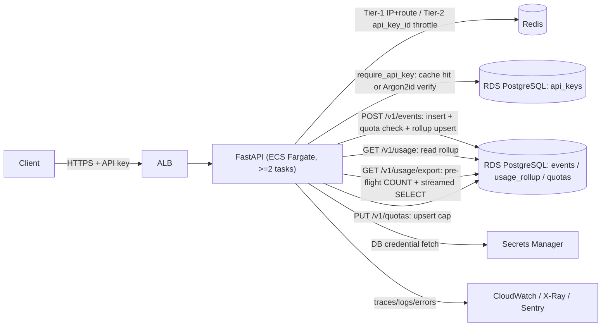

# Meterly — system architecture

## Overview

Meterly ingests metered usage events, serves aggregated per-customer/metric
counters (single-bucket read or a streamed CSV export), and enforces
admin-set per-customer, per-metric usage caps ("quotas"). Four authenticated
HTTP endpoints, one PostgreSQL database, one Redis rate-limit store, running
as a Docker container on ECS Fargate behind an ALB.

```
Client --HTTPS+API key--> ALB --> FastAPI (ECS Fargate, >=2 tasks)
                                     |-- Tier-1 (IP) / Tier-2 (api_key_id) throttle --> Redis
                                     |-- bound-parameter SQL, RLS-scoped -------------> RDS PostgreSQL
                                     |-- DB credential fetch ------------------------> Secrets Manager
                                     |-- traces/logs/errors -------------------------> CloudWatch/X-Ray/Sentry
```



## Request flow — `POST /v1/events`

1. Request-id/trace assigned, security headers queued (`src/logging/middleware.py`, `src/api/middleware.py`).
2. Tier-1 IP+route throttle (Redis token bucket; fails open on a Redis outage).
3. `require_api_key` — split-token parse, in-process verification-cache check,
   falling back to a DB lookup + Argon2id verify on a cache miss
   (`src/auth/__init__.py`, `src/auth/api_key.py`).
4. Tier-2 per-`api_key_id` throttle (`src/auth/rate_limit.py`).
5. Pydantic schema validation (`src/api/schemas/events.py`) — anchored
   allowlists, `extra='forbid'`.
6. `events_service.create_event` — one transaction:
   `INSERT ... ON CONFLICT (api_key_id, idempotency_key) DO NOTHING`, and only
   if a row was inserted:
   - the quota check: `read_tenant_quota_state_locked` locks the caller's
     quota row for `(customer, metric)` (if one exists) and reads the
     current-window rollup total fresh; if `R + Q > L` the service raises
     `QuotaExceededError` (429 `quota_exceeded`, `Retry-After` to the next
     hour boundary), which propagates out of the transaction and rolls back
     the event insert — no partial write, no rollup increment
     (`src/services/events_service.py`, `src/repositories/quotas_repo.py`).
   - otherwise, `INSERT ... ON CONFLICT ... DO UPDATE` the `usage_rollup`
     counter (`src/repositories/events_repo.py`).
   A duplicate `idempotency_key` (replay) never reaches the quota check at
   all — only the winning-insert branch does.
7. Error-envelope boundary catches anything unhandled and returns the generic
   `{error:{code,message,requestId}}` shape (`src/api/errors.py`); `AppError`
   lets a handler attach an explicit `app_code` (e.g. `quota_exceeded`) that
   overrides the default status->code map, so two different 429s
   (`rate_limited` vs. `quota_exceeded`) stay distinguishable to the caller.

## Request flow — `GET /v1/usage`

Same auth/throttle/error stack; the service floors `window` to the UTC hour
and reads a single `usage_rollup` row scoped by the caller's `api_key_id`
(`src/services/usage_service.py`, `src/repositories/usage_repo.py`). A missing
bucket returns zeros with 200, never 404.

## Request flow — `GET /v1/usage/export`

Same auth/throttle/error stack, plus a two-phase pre-flight-then-stream
design (`src/api/routes/usage_export.py`,
`src/services/usage_export_service.py`,
`src/repositories/usage_repo.py`):

1. `UsageExportQueryParams` validates the optional `customer_id`/`metric`/
   `from`/`to` filters (`src/api/schemas/usage_export.py`) — reuses the same
   `CustomerId`/`Metric` anchored allowlists as `events.py` and the same
   `[now-90d, now+1h]` bound idiom as `usage.py`'s `window`, applied here to
   a `[from, to]` range.
2. **Pre-flight cap check** (`prepare_export`): a `COUNT(*)` over the
   caller's rows (scoped by `api_key_id` first, plus the optional filters)
   inside its own transaction. Over 100,000 rows -> 422
   `validation_failed`, logged at `warn` (`usage.export.rejected`). This
   runs, and fully resolves, *before* any response byte — once a
   `StreamingResponse` is constructed the status line is already 200 and the
   cap decision can no longer cleanly 422. Any *other* (non-cap) error here
   propagates uncaught to the error-envelope boundary: a fail-closed generic
   500, transaction rolled back, no stream ever started.
3. **Stream** (`stream_export_csv`): a `StreamingResponse` whose body
   generator is pulled by Starlette only after the handler returns, so it
   opens its **own** tenant-scoped transaction (the `SET LOCAL
   app.current_api_key_id` RLS-backstop setting and the server-side cursor
   both need to stay valid for the whole stream, not just the pre-flight
   phase). Yields the header row first, always (an empty result is a 200
   header-only CSV, never 404), then one CSV-encoded row per record from
   `stream_usage_rollups` (`ORDER BY window_start, customer_id, metric` — a
   fixed literal, never client-derived — `LIMIT 100000`), each row written
   into a reused `io.StringIO` via stdlib `csv.writer` (RFC 4180, CRLF,
   `QUOTE_MINIMAL`) and drained to bytes immediately — constant memory
   throughout. `customer_id`/`metric` text cells pass through
   `src/api/csv_export.py`'s `escape_csv_text_cell` (the OWASP
   formula-injection defense: a leading `= + - @ \t \r` gets a `'` prefix)
   *before* reaching the writer; numeric/timestamp cells are formatted but
   never escaped (they're server-generated, never attacker-controlled).
   Logs exactly one `usage.export` audit event in a `finally` block
   (`rowCount`, `capped`, `completed`, filter-presence booleans — never the
   raw `customer_id`/`metric` values), so a client disconnect or a mid-stream
   DB error still records what was actually sent.

Response headers: `Content-Type: text/csv; charset=utf-8`,
`Content-Disposition: attachment; filename="usage-export-<UTC
timestamp>.csv"` (no tenant identifier in the filename), plus the inherited
`nosniff` and (via the existing `/v1/usage`-prefix rule in
`src/api/middleware.py`) `Cache-Control: no-store`.

**Accepted risk — mid-stream failure truncates the CSV.** Once the 200
status line and header bytes are on the wire, an unhandled error partway
through the stream can no longer be converted to a clean error envelope; the
client sees a truncated download it can re-request. This is strictly the
*post-200* case — the pre-flight `COUNT` phase above is fully recoverable
and does return the generic 500 envelope. Bounded by the row cap + Tier-2
throttle + connection-pool sizing; batched keyset pagination is the future
mitigation if this needs closing further.

## Request flow — `PUT /v1/quotas`

Admin-scoped create-or-replace of a per-customer, per-metric usage cap.
Auth -> Tier-2 per-`api_key_id` throttle -> an `admin`-scope assertion in the
route's composed dependency (403 `forbidden` for a non-admin key) -> schema
validation (`src/api/schemas/quotas.py`) -> `upsert_tenant_quota`, a single
`INSERT ... ON CONFLICT (api_key_id, customer_id, metric) DO UPDATE ...
RETURNING (xmax = 0) AS inserted` that reports create-vs-replace in one
round-trip (201 create / 200 replace), with a `quota.upsert` audit log
(`src/api/routes/quotas.py`, `src/services/quota_service.py`,
`src/repositories/quotas_repo.py`).

## Data model

- `api_keys` — the tenant/credential table (migration 0001), extended with a
  `scope` column (migration 0003: `'ingest'` default, `'admin'` elevated).
  `secret_hash` is Argon2id; `key_id` is the public split-token lookup
  handle. `scope='admin'` is a superset scope — an admin key does everything
  an ingest key does, plus call `PUT /v1/quotas`; a tenant that wants quotas
  provisions one admin-scoped key and uses it for both.
- `events` — append-only ingest log (migration 0001). `UNIQUE (api_key_id,
  idempotency_key)` is the idempotency guarantee; RLS policy
  `events_tenant_isolation` is the application-scoping backstop.
- `usage_rollup` — derived hourly aggregate (migration 0002, expand +
  backfill from `events`). Composite PK `(api_key_id, customer_id, metric,
  window_start)`; RLS policy `usage_rollup_tenant_isolation`.
- `quotas` — per-tenant, per-customer, per-metric usage caps (migration
  0003). PK `(api_key_id, customer_id, metric)`; `CHECK (limit_per_window >=
  1)`; RLS policy `quotas_tenant_isolation`. The `POST /v1/events` quota
  check takes `FOR UPDATE` on this row to serialize concurrent writers for
  the same `(customer, metric)` — see *Quota enforcement / atomicity* below.

## Quota enforcement / atomicity

Strict enforcement ("usage can never exceed `L`") is a check-then-act on a
shared counter — the classic TOCTOU. `read_tenant_quota_state_locked`
(`src/repositories/quotas_repo.py`) makes it race-free with a `SELECT
limit_per_window ... FOR UPDATE` on the quota row, run **as a separate
statement from the subsequent `usage_rollup` read**, both inside the same
transaction as the event insert and rollup increment
(`src/services/events_service.py`).

This two-round-trip shape is deliberate, not incidental: PostgreSQL's `FOR
UPDATE` only guarantees a fresh re-check of the *locked* row itself when a
waiter unblocks after the lock holder commits — it does **not** force a
fresh snapshot for another table read in the same statement (e.g. a `LEFT
JOIN` to `usage_rollup`). A waiter queued before the holder committed would
evaluate that join against its own pre-wait snapshot and read a stale total,
silently letting concurrent writers jointly exceed the cap. Splitting the
lock-acquire and the rollup-read into two statements gives the second query
its own fresh READ COMMITTED snapshot (taken *after* the lock is held),
which does reflect everything the previous holder just committed. This was
verified empirically during implementation: a single combined
`LEFT JOIN ... FOR UPDATE OF q` statement let every concurrent waiter read
the same stale total and all get admitted; the two-statement version
correctly serializes and caps admission at `L`
(`tests/integration/test_quota_concurrency.py`).

Unlimited customers (no quota row) take no lock at all — the first `SELECT
... FOR UPDATE` simply matches zero rows, so the common, zero-contention
path stays cheap (AC20 measures its added latency under load).

## Auth

Split-token API keys (`mtr_live_<key_id>_<secret>`), Argon2id-hashed at rest.
An in-process, TTL-bounded verification cache (keyed on the public `key_id`,
guarded by a constant-time digest comparison) avoids paying the Argon2id cost
on every request while the durable store stays Argon2id-only. See
`src/auth/__init__.py` for the full tradeoff writeup and
`scripts/seed_api_key.py` for the only key-provisioning path (no HTTP
endpoint in this build's scope; pass `--admin` to provision a `scope='admin'`
key for `PUT /v1/quotas`, including the DAST-context admin test key, DAST-3).

## Rate limiting

Two Redis token-bucket tiers (`src/auth/rate_limit.py`): Tier-1 pre-auth,
keyed on IP+route; Tier-2 post-auth, keyed on the authenticated
`api_key_id`. Both fail open (log a warning, allow the request) on a Redis
connection error rather than failing every request — an availability
tradeoff recorded in `.pipeline/surface-delta.md`.

## Observability

Structured JSON logs (structlog) to stdout -> CloudWatch, with a centralized
redaction processor (`src/logging/__init__.py`). OTel traces -> ADOT sidecar
-> X-Ray; Sentry for release-tagged error tracking with a `before_send`
PII/secret scrubber (`src/observability/`). SLO burn-rate alarms and the
minimum-three canary alarms are declared in `infra/modules/observability`.

## Infrastructure

Terraform under `infra/`: `modules/{network,compute,data,observability,edge}`
hold the real resources; `envs/{staging,prod}/main.tf` are the two
self-contained deploy roots (own provider + backend, since Terraform only
permits a backend configuration in a root module) that instantiate the same
modules at different scale. See each module's file header comments for the
specific resources and the security-baseline items they satisfy
(encryption at rest, private subnets, least-privilege IAM, no `BYPASSRLS`).

## Known deviations / accepted risks

See `.pipeline/surface-delta.md` for the rate-limit fail-open behavior and the
OTel/Sentry wiring-at-construction-time change vs. the plan's original
lifespan-hook placement. See `plan.md`'s "Open questions" section for the
accepted risks around key-revocation latency, `api_key_id`-as-tenant-scope,
and the Postgres app-role bootstrap's CI-network-reachability prerequisite.

**`GET /v1/usage/export` p95 at the 100,000-row cap — resolved (was: plan
§"Open questions" #1, originally unconfirmed).** The first measured p95
(~10.7s locally / 25.2s on testing's independent re-measure) was root-caused
during debugging to the streaming generator yielding **one chunk per row**:
the app's four nested `BaseHTTPMiddleware` layers (`src/main.py`) each
re-pump every streamed chunk through their own anyio memory-object-stream, so
cost scaled with `chunk_count x middleware_layers` and dominated wall-clock
time at the 100k-row cap — not CSV encoding or DB query time, which were both
sub-second in isolation. Three within-design fixes closed the gap (see
`.pipeline/debug-notes.md` for the full isolation profiling):
- `src/services/usage_export_service.py` batches `_ROWS_PER_CHUNK = 1000`
  encoded rows per yielded chunk (was one row per chunk) — the primary lever,
  cutting chunk count ~1,000x at the cap while staying constant-memory (the
  buffer holds at most one batch).
- `src/api/csv_export.py`'s `escape_csv_text_cell` replaced its per-character
  strip loop with a precompiled `str.translate` deletion table (semantics
  verified identical across all C0/DEL codepoints).
- `src/repositories/usage_repo.py`'s `stream_usage_rollups` tunes the
  server-side cursor with `execution_options(yield_per=_STREAM_FETCH_BATCH)`
  (`_STREAM_FETCH_BATCH = 5000`) — more rows fetched per DB round-trip,
  cursor still never abandoned.

Net effect: p95 dropped from ~10.7s to a stable **p95 ~1.6-2.1s** (10-sample
measurement). The original 500ms target proved unreachable within the
approved constant-memory-streaming design (an irreducible ~0.85-1.0s floor
from the server-side cursor drain + per-row CSV encoding, even discounting
middleware). The human confirmed a revised, binding budget of **p95 <=
3,000ms at the 100,000-row cap** at the 2026-07-09 escalation, which
`tests/integration/test_usage_export_perf.py` now hard-asserts (AC16); this
session's re-run measured p95 1,643.87ms, comfortably under the bound.
