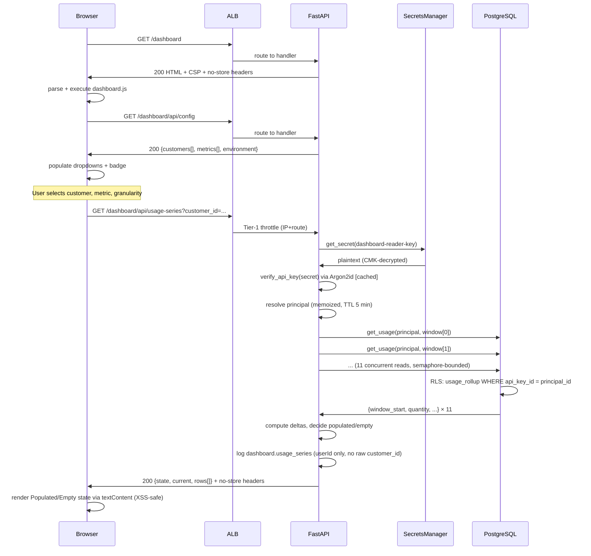

# Meterly — system architecture (first feature)

## Overview

Meterly ingests metered usage events and serves aggregated per-customer/metric
counters via HTTP APIs and a read-only web dashboard. Three authenticated HTTP
endpoints (event ingest, usage query, dashboard), one PostgreSQL database, one
Redis rate-limit store, and AWS Secrets Manager for credential management,
running as a Docker container on ECS Fargate behind an ALB.

```
Client/Browser --HTTPS+API key--> ALB --> FastAPI (ECS Fargate, >=2 tasks)
                                            |-- Tier-1 (IP) / Tier-2 (api_key_id) throttle --> Redis
                                            |-- bound-parameter SQL, RLS-scoped ----------> RDS PostgreSQL
                                            |-- DB credential fetch ---------------------> Secrets Manager
                                            |-- dashboard-reader credential fetch -------> Secrets Manager
                                            |-- traces/logs/errors ----------------------> CloudWatch/X-Ray/Sentry
```

**Note:** The dashboard is served as static HTML/CSS/JS; the browser fetches
data from the same-origin BFF without ever holding an API key. The reader
credential is server-held in Secrets Manager and never sent to the browser.

## Request flow — `POST /v1/events`

1. Request-id/trace assigned, security headers queued (`src/logging/middleware.py`, `src/api/middleware.py`).
2. Tier-1 IP+route throttle (Redis token bucket; fails open on a Redis outage).
3. `require_api_key` — split-token parse, in-process verification-cache check,
   falling back to a DB lookup + Argon2id verify on a cache miss
   (`src/auth/__init__.py`, `src/auth/api_key.py`).
4. Tier-2 per-`api_key_id` throttle (`src/auth/rate_limit.py`).
5. Pydantic schema validation (`src/api/schemas/events.py`) — anchored
   allowlists, `extra='forbid'`.
6. `events_service.create_event` — one transaction:
   `INSERT ... ON CONFLICT (api_key_id, idempotency_key) DO NOTHING`, and only
   if a row was inserted, `INSERT ... ON CONFLICT ... DO UPDATE` the
   `usage_rollup` counter (`src/services/events_service.py`,
   `src/repositories/events_repo.py`).
7. Error-envelope boundary catches anything unhandled and returns the generic
   `{error:{code,message,requestId}}` shape (`src/api/errors.py`).

## Request flow — `GET /v1/usage`

Same auth/throttle/error stack; the service floors `window` to the UTC hour
and reads a single `usage_rollup` row scoped by the caller's `api_key_id`
(`src/services/usage_service.py`, `src/repositories/usage_repo.py`). A missing
bucket returns zeros with 200, never 404.

## Request flow — Usage Dashboard (served page + BFF)

### Browser request: `GET /dashboard` (static HTML)

1. Request-ID/trace assigned, security headers queued.
2. Tier-1 IP throttle (Redis token bucket).
3. No auth required (page is served unauthenticated to the viewer).
4. Security headers set: `Cache-Control: no-store`, strict page CSP
   (`script-src 'self'`, no `unsafe-inline`/`unsafe-eval`), `frame-ancestors
   'none'` (clickjacking defense), `Referrer-Policy`, `HSTS` (prod).
5. `FileResponse` returns the static dashboard.html with the above headers.
6. Browser renders the HTML, fetches dashboard.css and dashboard.js.

### Browser JavaScript: Fetch config and data

7. `dashboard.js` fetches `GET /dashboard/api/config` (no auth, no cache).
8. Response: `{customers: [...], metrics: [...], granularities: [...],
   environment: "prod"|"staging"}` from `Settings` (single source of truth for
   dropdowns and environment badge).
9. Populate the Customer and Metric `<select>` options and the environment
   badge from config.
10. User selects a customer, metric, and granularity (hour/day).
11. `dashboard.js` fetches `GET /dashboard/api/usage-series?customer_id=...
    &metric=...&granularity=...` (no client auth, query-string params).
12. Response: `{state: "populated|empty", current: {window_start,quantity,...},
    rows: [{window_start, quantity, delta, ...}, ...]}` from the BFF.
13. Render the populated/empty state based on `state` via `textContent`
    (XSS-safe DOM sink).

### Server-side BFF: `GET /dashboard/api/usage-series`

14. Request-ID/trace, Tier-1 throttle (same stack as other routes).
15. **Resolve the server-held dashboard-reader principal** from AWS Secrets
    Manager via the secrets facade (`get_secret`), verify it via `verify_api_key`
    (Argon2id check), and memoize in-process with a short TTL (5 min default) to
    avoid repeated Argon2id costs on the fan-out reads.
16. Schema validation: `customer_id` and `metric` must be in their configured
    allowlists; `granularity` must be `hour` or `day` (month deferred per Q1);
    `extra='forbid'`.
17. Compute the **11 window-start timestamps** ending at the server's current
    UTC hour, stepping by granularity:
    - **hour granularity:** 11 one-hour steps.
    - **day granularity:** 11 one-day steps.
18. Fan out to **`get_usage(dashboard_reader_principal, ...)`** in-process for
    each window (11 or 264 concurrent reads, bounded by `asyncio.Semaphore`).
    Each read is scoped to the reader's `api_key_id` and the RLS policy
    (`usage_rollup_tenant_isolation`), so only that tenant's usage is returned.
19. Aggregate the results:
    - Current usage = newest window's total.
    - Last-10 windows = the prior 10 rows.
    - Deltas = window *i* vs window *i+1*, formatted absolute (up/down/neutral).
20. Decide populated vs. empty: if all 11 windows are zero, signal empty.
21. **Log the `dashboard.usage_series` audit event** with `userId=<reader
    api_key_id>`, `action=read`, `granularity`, `windows=<count>`, `state`, and
    **never the raw `customer_id`**.
22. Return the response (HTTPS, `no-store`, strict JSON CSP).
23. Error-envelope boundary catches anything unhandled (validation, read
    failure, principal resolution) and returns the generic
    `{error:{code,message,requestId}}` with no stack/secret leakage.

### Credential path: Dashboard-reader key lifecycle

```
Deployment (manual, out-of-band):
  ├─ scripts/seed_api_key.py --write-to-secret (mint the reader key)
  │  ├─ INSERT api_keys row (key_id, secret_hash=Argon2id(secret))
  │  └─ aws secretsmanager put-secret-value (store plaintext in Secrets Manager)
  └─ Terraform: aws_secretsmanager_secret.dashboard_reader
     ├─ CMK encryption (kms_key_id = aws_kms_key.data.arn, existing data CMK)
     └─ Name: meterly/<env>/dashboard-reader-key

Runtime (every 5 min or on TTL expiry):
  ├─ dashboard_reader.py: get_dashboard_reader_principal()
  │  ├─ get_secret("meterly/<env>/dashboard-reader-key") — fetches plaintext from Secrets Manager
  │  ├─ verify_api_key(secret) — Argon2id verification (expensive, cached)
  │  └─ memoize result in-process with 5 min TTL
  └─ dashboard_service.py: pass the resolved principal to get_usage()
     └─ RLS policy: usage_rollup_tenant_isolation scopes all reads to this principal's tenant

IAM grant (infra/modules/compute/main.tf):
  └─ Task role policy: ReadDashboardReaderSecret statement
     ├─ Action: secretsmanager:GetSecretValue
     └─ Resource: arn:aws:secretsmanager:*:*:secret:meterly/<env>/dashboard-reader-key (exact ARN, no wildcard)
```

The reader key is **never in source code, container image, Terraform state, or
tfvars**. It is **never sent to the browser**. It is **never logged in raw form**
(structlog redaction processor lists `mtr_live_*` patterns).

## Sequence diagram — Usage Dashboard (browser to BFF to database)



## Data model

- `api_keys` — the tenant/credential table (migration 0001). `secret_hash` is
  Argon2id; `key_id` is the public split-token lookup handle.
- `events` — append-only ingest log (migration 0001). `UNIQUE (api_key_id,
  idempotency_key)` is the idempotency guarantee; RLS policy
  `events_tenant_isolation` is the application-scoping backstop.
- `usage_rollup` — derived hourly aggregate (migration 0002, expand +
  backfill from `events`). Composite PK `(api_key_id, customer_id, metric,
  window_start)`; RLS policy `usage_rollup_tenant_isolation`.

## Auth

Split-token API keys (`mtr_live_<key_id>_<secret>`), Argon2id-hashed at rest.
An in-process, TTL-bounded verification cache (keyed on the public `key_id`,
guarded by a constant-time digest comparison) avoids paying the Argon2id cost
on every request while the durable store stays Argon2id-only. See
`src/auth/__init__.py` for the full tradeoff writeup and
`scripts/seed_api_key.py` for the only key-provisioning path (no HTTP
endpoint in this build's scope).

## Rate limiting

Two Redis token-bucket tiers (`src/auth/rate_limit.py`): Tier-1 pre-auth,
keyed on IP+route; Tier-2 post-auth, keyed on the authenticated
`api_key_id`. Both fail open (log a warning, allow the request) on a Redis
connection error rather than failing every request — an availability
tradeoff recorded in `.pipeline/surface-delta.md`.

## Observability

Structured JSON logs (structlog) to stdout -> CloudWatch, with a centralized
redaction processor (`src/logging/__init__.py`). OTel traces -> ADOT sidecar
-> X-Ray; Sentry for release-tagged error tracking with a `before_send`
PII/secret scrubber (`src/observability/`). SLO burn-rate alarms and the
minimum-three canary alarms are declared in `infra/modules/observability`.

## Infrastructure

Terraform under `infra/`: `modules/{network,compute,data,observability,edge}`
hold the real resources; `envs/{staging,prod}/main.tf` are the two
self-contained deploy roots (own provider + backend, since Terraform only
permits a backend configuration in a root module) that instantiate the same
modules at different scale. See each module's file header comments for the
specific resources and the security-baseline items they satisfy
(encryption at rest, private subnets, least-privilege IAM, no `BYPASSRLS`).

**Credential management:** The database URL and the dashboard-reader API key
are both provisioned as AWS Secrets Manager secrets (CMK-encrypted with the
existing data KMS key). Secrets are never stored in Terraform state or source
code; plaintext values are written out-of-band via `scripts/seed_api_key.py`.
The ECS task role has least-privilege `secretsmanager:GetSecretValue` statements
scoped to exactly each secret's ARN (no wildcard `Resource`). See the
`modules/data` and `modules/compute` file headers for the specific secret
definitions and IAM grants.

## Known deviations / accepted risks

See `.pipeline/surface-delta.md` for the rate-limit fail-open behavior and the
OTel/Sentry wiring-at-construction-time change vs. the plan's original
lifespan-hook placement. See `plan.md`'s "Open questions" section for the
accepted risks around key-revocation latency, `api_key_id`-as-tenant-scope,
and the Postgres app-role bootstrap's CI-network-reachability prerequisite.
