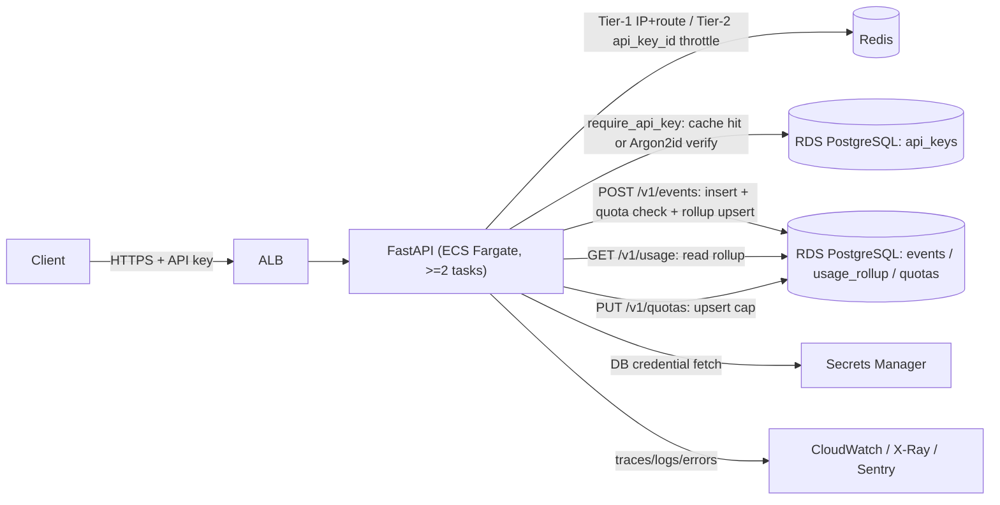

# Meterly — system architecture

## Overview

Meterly ingests metered usage events, serves aggregated per-customer/metric
counters, and enforces admin-set per-customer, per-metric usage caps
("quotas"). Three authenticated HTTP endpoints, one PostgreSQL database, one
Redis rate-limit store, running as a Docker container on ECS Fargate behind an ALB.

```
Client --HTTPS+API key--> ALB --> FastAPI (ECS Fargate, >=2 tasks)
                                     |-- Tier-1 (IP) / Tier-2 (api_key_id) throttle --> Redis
                                     |-- bound-parameter SQL, RLS-scoped -------------> RDS PostgreSQL
                                     |-- DB credential fetch ------------------------> Secrets Manager
                                     |-- traces/logs/errors -------------------------> CloudWatch/X-Ray/Sentry
```



## Request flow — `POST /v1/events`

1. Request-id/trace assigned, security headers queued (`src/logging/middleware.py`, `src/api/middleware.py`).
2. Tier-1 IP+route throttle (Redis token bucket; fails open on a Redis outage).
3. `require_api_key` — split-token parse, in-process verification-cache check,
   falling back to a DB lookup + Argon2id verify on a cache miss
   (`src/auth/__init__.py`, `src/auth/api_key.py`).
4. Tier-2 per-`api_key_id` throttle (`src/auth/rate_limit.py`).
5. Pydantic schema validation (`src/api/schemas/events.py`) — anchored
   allowlists, `extra='forbid'`.
6. `events_service.create_event` — one transaction:
   `INSERT ... ON CONFLICT (api_key_id, idempotency_key) DO NOTHING`, and only
   if a row was inserted:
   - the quota check: `read_tenant_quota_state_locked` locks the caller's
     quota row for `(customer, metric)` (if one exists) and reads the
     current-window rollup total fresh; if `R + Q > L` the service raises
     `QuotaExceededError` (429 `quota_exceeded`, `Retry-After` to the next
     hour boundary), which propagates out of the transaction and rolls back
     the event insert — no partial write, no rollup increment
     (`src/services/events_service.py`, `src/repositories/quotas_repo.py`).
   - otherwise, `INSERT ... ON CONFLICT ... DO UPDATE` the `usage_rollup`
     counter (`src/repositories/events_repo.py`).
   A duplicate `idempotency_key` (replay) never reaches the quota check at
   all — only the winning-insert branch does.
7. Error-envelope boundary catches anything unhandled and returns the generic
   `{error:{code,message,requestId}}` shape (`src/api/errors.py`); `AppError`
   lets a handler attach an explicit `app_code` (e.g. `quota_exceeded`) that
   overrides the default status->code map, so two different 429s
   (`rate_limited` vs. `quota_exceeded`) stay distinguishable to the caller.

## Request flow — `GET /v1/usage`

Same auth/throttle/error stack; the service floors `window` to the UTC hour
and reads a single `usage_rollup` row scoped by the caller's `api_key_id`
(`src/services/usage_service.py`, `src/repositories/usage_repo.py`). A missing
bucket returns zeros with 200, never 404.

## Request flow — `PUT /v1/quotas`

Admin-scoped create-or-replace of a per-customer, per-metric usage cap.
Auth -> Tier-2 per-`api_key_id` throttle -> an `admin`-scope assertion in the
route's composed dependency (403 `forbidden` for a non-admin key) -> schema
validation (`src/api/schemas/quotas.py`) -> `upsert_tenant_quota`, a single
`INSERT ... ON CONFLICT (api_key_id, customer_id, metric) DO UPDATE ...
RETURNING (xmax = 0) AS inserted` that reports create-vs-replace in one
round-trip (201 create / 200 replace), with a `quota.upsert` audit log
(`src/api/routes/quotas.py`, `src/services/quota_service.py`,
`src/repositories/quotas_repo.py`).

## Data model

- `api_keys` — the tenant/credential table (migration 0001), extended with a
  `scope` column (migration 0003: `'ingest'` default, `'admin'` elevated).
  `secret_hash` is Argon2id; `key_id` is the public split-token lookup
  handle. `scope='admin'` is a superset scope — an admin key does everything
  an ingest key does, plus call `PUT /v1/quotas`; a tenant that wants quotas
  provisions one admin-scoped key and uses it for both.
- `events` — append-only ingest log (migration 0001). `UNIQUE (api_key_id,
  idempotency_key)` is the idempotency guarantee; RLS policy
  `events_tenant_isolation` is the application-scoping backstop.
- `usage_rollup` — derived hourly aggregate (migration 0002, expand +
  backfill from `events`). Composite PK `(api_key_id, customer_id, metric,
  window_start)`; RLS policy `usage_rollup_tenant_isolation`.
- `quotas` — per-tenant, per-customer, per-metric usage caps (migration
  0003). PK `(api_key_id, customer_id, metric)`; `CHECK (limit_per_window >=
  1)`; RLS policy `quotas_tenant_isolation`. The `POST /v1/events` quota
  check takes `FOR UPDATE` on this row to serialize concurrent writers for
  the same `(customer, metric)` — see *Quota enforcement / atomicity* below.

## Quota enforcement / atomicity

Strict enforcement ("usage can never exceed `L`") is a check-then-act on a
shared counter — the classic TOCTOU. `read_tenant_quota_state_locked`
(`src/repositories/quotas_repo.py`) makes it race-free with a `SELECT
limit_per_window ... FOR UPDATE` on the quota row, run **as a separate
statement from the subsequent `usage_rollup` read**, both inside the same
transaction as the event insert and rollup increment
(`src/services/events_service.py`).

This two-round-trip shape is deliberate, not incidental: PostgreSQL's `FOR
UPDATE` only guarantees a fresh re-check of the *locked* row itself when a
waiter unblocks after the lock holder commits — it does **not** force a
fresh snapshot for another table read in the same statement (e.g. a `LEFT
JOIN` to `usage_rollup`). A waiter queued before the holder committed would
evaluate that join against its own pre-wait snapshot and read a stale total,
silently letting concurrent writers jointly exceed the cap. Splitting the
lock-acquire and the rollup-read into two statements gives the second query
its own fresh READ COMMITTED snapshot (taken *after* the lock is held),
which does reflect everything the previous holder just committed. This was
verified empirically during implementation: a single combined
`LEFT JOIN ... FOR UPDATE OF q` statement let every concurrent waiter read
the same stale total and all get admitted; the two-statement version
correctly serializes and caps admission at `L`
(`tests/integration/test_quota_concurrency.py`).

Unlimited customers (no quota row) take no lock at all — the first `SELECT
... FOR UPDATE` simply matches zero rows, so the common, zero-contention
path stays cheap (AC20 measures its added latency under load).

## Auth

Split-token API keys (`mtr_live_<key_id>_<secret>`), Argon2id-hashed at rest.
An in-process, TTL-bounded verification cache (keyed on the public `key_id`,
guarded by a constant-time digest comparison) avoids paying the Argon2id cost
on every request while the durable store stays Argon2id-only. See
`src/auth/__init__.py` for the full tradeoff writeup and
`scripts/seed_api_key.py` for the only key-provisioning path (no HTTP
endpoint in this build's scope; pass `--admin` to provision a `scope='admin'`
key for `PUT /v1/quotas`, including the DAST-context admin test key, DAST-3).

## Rate limiting

Two Redis token-bucket tiers (`src/auth/rate_limit.py`): Tier-1 pre-auth,
keyed on IP+route; Tier-2 post-auth, keyed on the authenticated
`api_key_id`. Both fail open (log a warning, allow the request) on a Redis
connection error rather than failing every request — an availability
tradeoff recorded in `.pipeline/surface-delta.md`.

## Observability

Structured JSON logs (structlog) to stdout -> CloudWatch, with a centralized
redaction processor (`src/logging/__init__.py`). OTel traces -> ADOT sidecar
-> X-Ray; Sentry for release-tagged error tracking with a `before_send`
PII/secret scrubber (`src/observability/`). SLO burn-rate alarms and the
minimum-three canary alarms are declared in `infra/modules/observability`.

## Infrastructure

Terraform under `infra/`: `modules/{network,compute,data,observability,edge}`
hold the real resources; `envs/{staging,prod}/main.tf` are the two
self-contained deploy roots (own provider + backend, since Terraform only
permits a backend configuration in a root module) that instantiate the same
modules at different scale. See each module's file header comments for the
specific resources and the security-baseline items they satisfy
(encryption at rest, private subnets, least-privilege IAM, no `BYPASSRLS`).

## Known deviations / accepted risks

See `.pipeline/surface-delta.md` for the rate-limit fail-open behavior and the
OTel/Sentry wiring-at-construction-time change vs. the plan's original
lifespan-hook placement. See `plan.md`'s "Open questions" section for the
accepted risks around key-revocation latency, `api_key_id`-as-tenant-scope,
and the Postgres app-role bootstrap's CI-network-reachability prerequisite.
